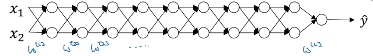
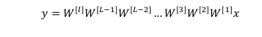
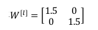
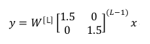
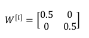
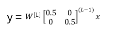
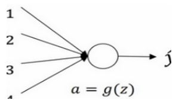
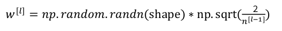
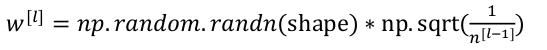

训练深层神经网络的时候，容易发生梯度消失或梯度爆炸，也就是导数或坡度有时会变得非常大，或者非常小，甚至于以指数方式变小，这加大了训练的难度。

## 梯度消失, 梯度爆炸

假设我们的神经网络有n层, 并且让每一层的 b = 0, 用线性激活函数, g(z) = z, 模型图如下:

那么可以得到最后的预测值为:

假设前L-1层权重W都初始化为:

那么最后得到的 y帽 为:

可以看到最后的 y帽 的值以指数的形式爆炸增长, 造成梯度爆炸

另一种情况是前L-1层权重W都初始化为:

那么最后得到的 y帽 为:

可以看到最后的 y帽 的值指数级下降, 造成梯度消失

## 权重初始化

根据上面的分析, 权重的初始化很重要, 首先看看只有一个神经元的情况:

假设 b = 0 , 可以得到:

为了让 z 不至于太大,  我们希望 w_i 尽量小一些, 实际上, 我们会这么做:

如果你使用的是 Relu 函数, 那么 W 可以这么初始化:

如果你使用的是 tanh 函数, 那么 W 可以这么初始化:

其中, n^[l−1] 表示第l层的输入特征的个数, 也就是第 l - 1 层神经元的个数.