logistic回归是一种分类算法，用于二分类问题。

### 基础知识

处理一张图片的时候，通常需要将图片各个像素的三个通道的数值用特征值（一维列向量x）的形式表示。x 的维度为图片长度 \* 图片宽度 \* 3. 因此，下图所示的64*64图片的特征向量 x 的维度为64 \* 64 \* 3 = 12288. 

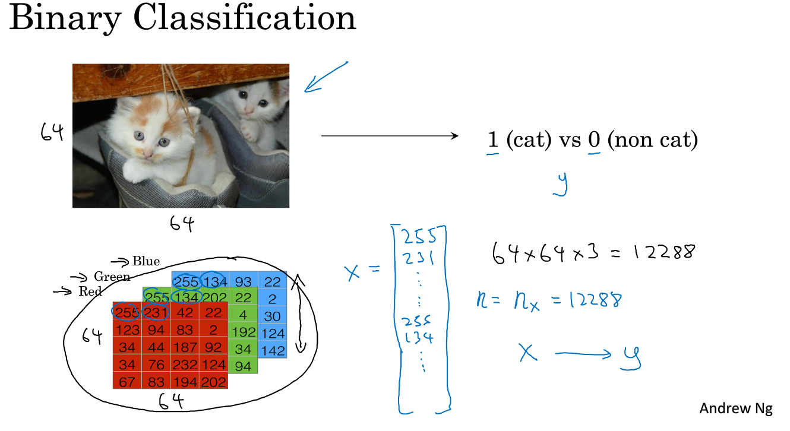

如果有多个图片，则将这些图片的特征值拼在一起，拼成一个矩阵 ，如下图所示：


X = [x1, x2, x3 ... xn]^T

同样可以把 实际值 label 拼在一起构成矩阵 Y：

Y = [y1, y2, y3 ... yn]


### logistic 回归

logistic 回归要做的就是将特征 X 作为输入，然后经过处理后得到符合某个结果的概率，例如得到一张图片是否含有猫的概率。

如下图所示，通常，我们在公式的右上角添加上标 i 表示这是第 i 个训练集的相关数据。x 通常表示输入的特征向量，y 表示正确的结果例如0或者1, 我们称 y 为标签（label）。

我们希望通过训练得到权值向量 w ，以及一个常数 b，来表示输入与输出之间的函数关系，使得预测结果 y帽 近似于真实结果 y 。

也许我们可以使用 y = w^T * x + b 来预测结果，但是 y 的值 可能不是 0-1 直接的数，所以我们引入sigmoid函数。Sigmoid 函数的图像如下，用于将任意常数映射到 0 - 1 之间的一个数。


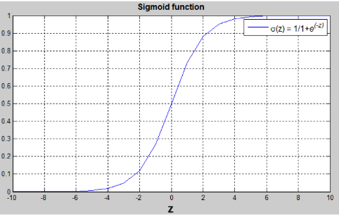

sigmoid 函数的参数是 z，而 z = w^T * x + b。最终预测的结果用 y帽（y 头上有个 ^） 表示，根据图像可以知道，y帽 的值肯定是个介于 0 -1 之间。

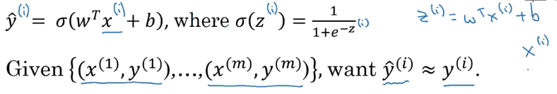

图片中 x 向量是已知的，而 w 和 b 是未知的，所以我们要做的就是让程序学习参数 w 和 b 。

参考资料：

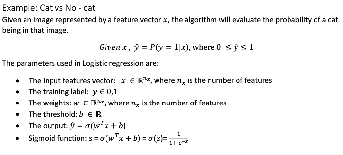

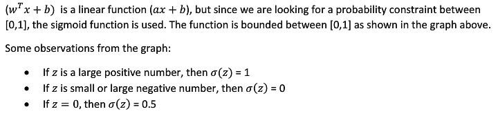

### 损失函数（loss function）

我们还需要一个损失函数L来衡量预测结果 y帽 和真实结果y有多接近，一般是使用下图蓝色框内的函数（图片中该函数表达式少了一个右括号“ )”     ）

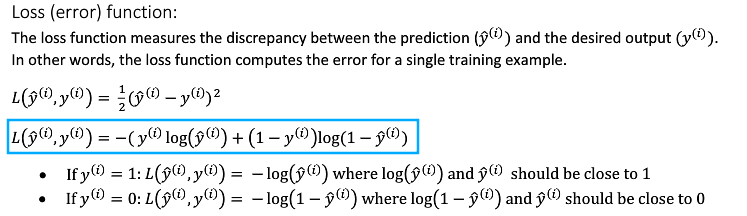 

我们看看损失函数为何能起到作用，当 y 等于1的时候，L = - log( y帽 )，想要 L 尽可能小，就要让 y帽 尽可能大，而 y帽 是经过 Sigmoild 函数处理过的值，所以 y帽 会趋近于 1，换句话说，也就趋近于真实值 y 了。同理，当 y 等于 0 时， 只有 y帽 趋近于 0 的时候，L 才会是最小的。

### 成本函数（cost function）

损失函数只适用于**单个**训练样本，因此引入了成本函数（cost function）来衡量**全体**训练样本的表现情况，它实际上是将所有单个样本的 L 累加起来取平均值。

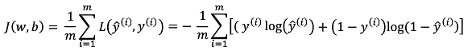


我们要在训练的过程中找到一组 w 和 b 使得成本函数 J 的值最小。

### 梯度下降算法

损失函数和成本函数只是用来衡量求得的 w 和 b 的误差大小，当我们找到了一组 w 和 b 的值后，如何去优化和调整，则需要借助梯度下降算法。

下图是 J(w, b) 的函数图像，其中 w 是一个多维的向量，为了方便表示，我们将 w 看做一个变量。 这一个凸函数，可以找到 J 的一个最小值。

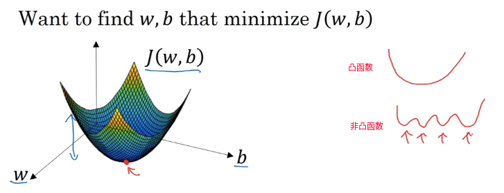

​	

训练之前，我们需要初始化 w 和 b，通常是用0，或者随机值来初始化。梯度下降法要做的就是从某个初始点开始，沿着下降坡度最陡的方向前进，进而走到最低点出。


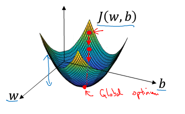

w 和 b 的更新过程如下：

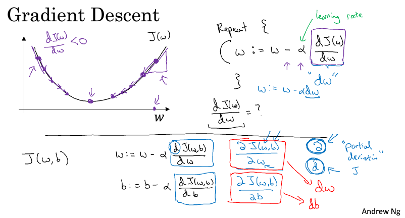

> w :=  w - α \* ∂ J(w, b) / ∂w，        
>
> b :=  b - α \* ∂ J(w, b) / ∂b，

符号 := 表示更新。

α是学习率，用于控制 每次梯度下降的步长，设置的太小，会导致迭代次数过多；设置过大就会跳过最低点，最终导致 J 无法收敛。

∂ J(w, b) / ∂b在代码中通常用 db 表示， ∂ J(w, b) / ∂w 在代码中通常用 dw 表示.

可以看到 w 和 b 都是沿着梯度下降的，因此经过多次迭代，我们可以从任意点以最快的速度到达最低点。

### 单个样本的梯度下降法

我们回顾一下前面学到的公式：


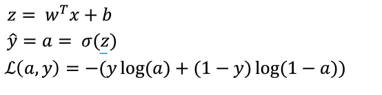

其中，


假设某个样本的特征只有 x1 和 x2 ，即(2,1)的列向量： x = [x1, x2]^T,  w 是一个(2,1)的列向量， 那么 根据 z = w^T \* X + b 可以得到下面的图，其中w1, w2, b 是未知的参数，之后我们会通过训练获得一组最佳的取值。


不难得到 ：

> da / dz = a \* (1 - a)；							①
>
> dL / da = - y / a + (1 - y) / (1 - a)；					②
>

于是，根据链式求导法则，从图中右边向左推，得到：

> **dz = dL / dz = ② \* ① = a - y**；

再进一步，我们还可以得到 :

> dw1 = dL / dw1 = ( dL / dz ) \* ( dz / dw1) = dz \* x1 = ( a - y ) \* x1
>
> dw2 = dL / dw2 = ( dL / dz ) \* ( dz / dw2) = dz \* x2 = ( a - y ) \* x2
>
> db    = dL / db = ( dL / dz ) \* ( dz / db) = dz \* 1 = ( a - y )
>

然后更新w1, w2, b 的值即可：

> w1 :=  w1 - dw1 \* α （α 是学习率），        
>
> w2 :=  w2 - dw2 \* α，        
>
> b :=  b - α \* db；

这样我们就完成了单个样本的参数更新

### 多个样本的梯度下降

先回顾一下成本函数 J(w, b) 的含义, 它是m个样本损失函数求和后的平均值.   注意到公式里有上角标 i ,表示这是第 i 个样本的数据.

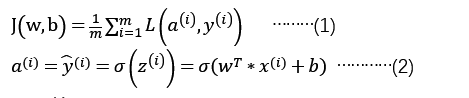

既然 成本函数 J 是 所有样本的 L 累加后的平均值, **那么 J 对 w1 的导数 等价于 各个 L 对 w1 的导数求和后的平均值**, 同理, 那么 J 对 w2, b 的导数 也是 各个L 对 w2, b 的导数求和后的平均值.

于是得到各个参数更新过程的伪代码如下:

```python
# 初始化变量
J=0,dw_1=0,dw_2=0,db=0

# 遍历m个数据集
for i = 1 to m 
      z(i) = w^T*x(i)+b
      a(i) = sigmoid(z(i))
      J += -[y(i)log(a(i))+(1-y(i)）log(1-a(i))
      dz(i) = a(i)-y(i)
			# dw1 dw2 db 用作累加器, 循环结束后除以m即可得到平均值
      dw1 += x1(i)dz(i)
      dw2 += x2(i)dz(i)
      # 假设每个样本只有两个维度, 因此只要累加 dw1, dw2 即可
      # 如果x有n个维度 ,就需要使用   for循环   遍历x所有的特征,累加 dw3, dw4 .... dwn
      # dw3 += x3(i)dz(i)
      # .......
      # dwn += xn(i)dz(i)
      db += dz(i)
 J /= m
 # 取平均值
 dw1 /= m
 dw2 /= m
 db /= m
 # 更新dw1 dw2 db， alpha 是学习率
 w1 = w1 - alpha*dw1
 w2 = w2 - alpha*dw2
 b  = b  - alpha*db
```

这样, m 个样本的各个参数也就能得到调整了. 但是这部分代码,  仅仅更新了这些参数一次, 需要多次执行,  才能让 J 沿着梯度下降到最低点.

这部分代码使用的 for 循环会造成执行效率不高, 如果我们可以把部分数据 向量化, 利用矩阵乘法代替 for 循环可以大幅度提高程序执行效率.

### 向量化

我们可以对代码进行三处改动：

① 使用 numpy 生成 (n_x, 1) 的列矩阵存放w1, w2, w3..wn , 并初始化为0

② 利用矩阵的加法，将第 i 个样本 x^(i) 的每个特征全部乘以 dz^(i) 并与 列向量 dw 相加

③ 利用 numpy 的特性， dw /= m 可以使得 dw 中每个元素都除以 m

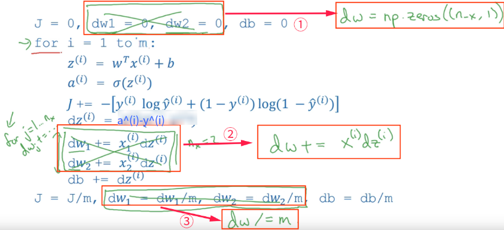

这样无论输入的 x 维度如何，我们都不需要使用 for 循环来计算dw1, dw2,  ... dwn了。

发现外层还有一个 for 循环用于遍历每个样本，我们也可以想办法去掉该for循环。

### 向量化logistc回归

现在我们着手去掉外面的这个for循环，先从下图  蓝色框  部分着手吧：

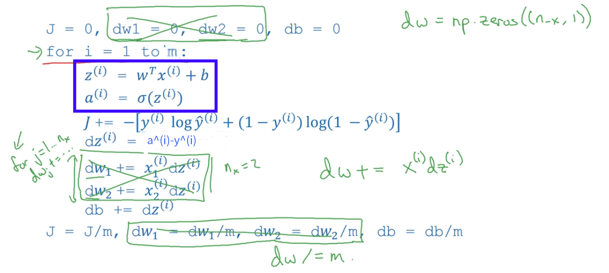

logistc回归的正向传播过程需要先计算 z^(i) 再通过激活函数计算 a^(i). 例如第1, 2, 3个样本需要进行这些计算：

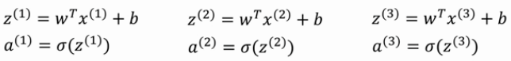

第一行中，我们需要用 w^T 乘上每个样本 x^(i) 后加上 b。我们可以这样构造一个矩阵 X = [x^(1), x^(2), x^(3)] 这是一个 (n, 3) 的矩阵，每一列都是一个样本的特征。如果我们 用 w^T * X + [ b b b ] 就可以得到 

[ w^T * x^(1) + b, w^T * x^(2) + b, w^T * x^(3) + b ] = [ z^(1), z^(2), z^(3) ] = Z

这样的计算可以用np.dot(w^T, X) + b 实现。

举个例子：

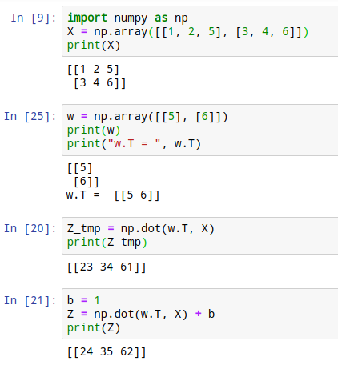

可以看到 b 虽然是一个常数，但是 numpy 会自动将 b 转换为 (1, 3) 的行向量, 在**python中这叫做广播**.

综上，可以得到，如果样本有m个，则构造 (n, m) 的 X 即可去掉外层的for循环, 一次性对所有的样本进行计算。

当我们计算出 Z  的时候，我们还需要将 Z 作为 Sigmoid 函数的参数，最终得到 矩阵 A = [a^(1), a^(2), a^(3)....a^(m)].

到此，**正向传播**的过程就结束了，没有使用 for 循环。

另外，计算梯度的时候也可以利用向量化，提高执行效率呢。

###  向量化logistc回归的梯度输出

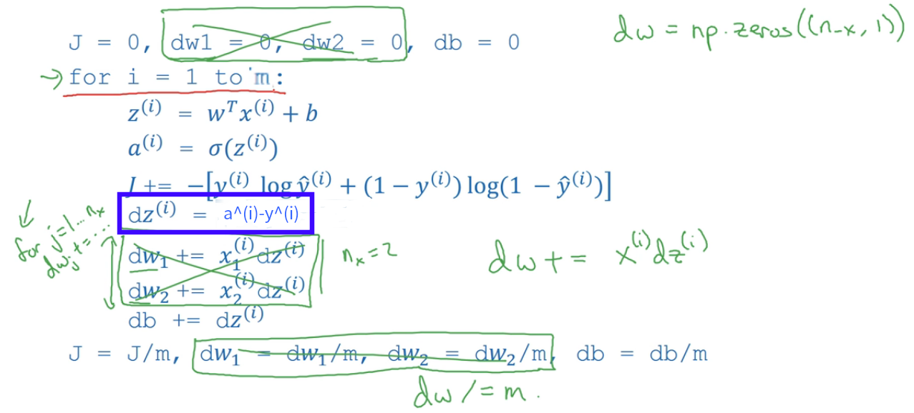


在计算梯度时，我们需要计算：

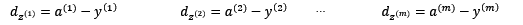

我们设置(1, m)的矩阵 dZ = [ dz^(1), dz^(2) ..... , dz^(m) ]，以及 (1, m) 的矩阵 A = [ a^(1), a^(2) ..... , a^(m) ] 和  (1, m) 的矩阵 Y = [ y^(1), y^(2) ..... , y^(m) ] 

这样，我们可以得到 dZ = A - Y 


下面这张图中可以看到，

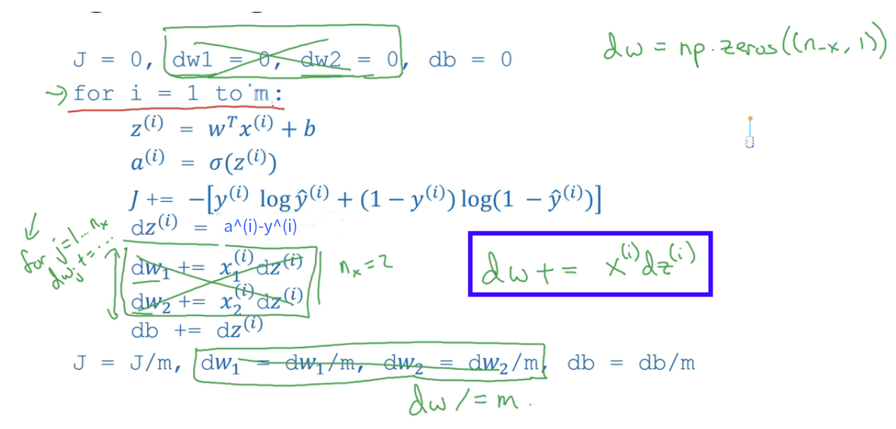


for循环执行完毕的时候，dw = x^(1)\*dz^(1) + x^(2)\*dz^(2)  + ..... + x^(m)\*dz^(m)  

别忘了还得取平均值：dw /= m

这个过程可以换个表达形式：

dw  = 1 / m * ( x^(1)\*dz^(1) + x^(2)\*dz^(2)  + ..... + x^(m)\*dz^(m) )

dw  = 1 / m * [ x^(1), x^(2) ..... x^(m) ] x [ dz^(1), dz^(2), ....  dz^(m) ]^T

**dw  = 1 / m * X \* dZ^T**

或者看下面的图片也能理解：

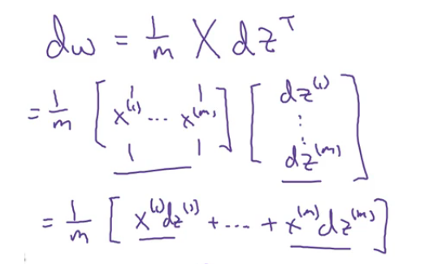

最终 dw 还是一个 (n, 1) 的列向量。


而 db 则是矩阵 dZ 所有元素的和，可以用代码表示为：

**db = 1 / m * np.sum( dZ )**

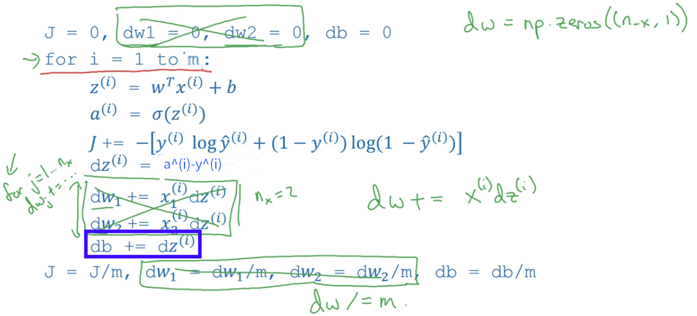


最后，我们去掉for循环后得到的代码如下：

```python
Z = np.dot(w^T, X) + b
A = σ(Z)
dZ = A - Y
dw = 1 / m * np.dot(X, dZ^T)
db = 1 / m * np.sum( dZ )
w = w - dw * alpha
b = b - db * alpha
```

这样就完成了m个样本的梯度下降的一次迭代。然而，我们需要多次迭代才能使得成本函数 J 到达最低点，因此 我们仍然需要使用 for 循环，并且，应该没有方法可以把这个for循环去掉。

到这里，logistic回归的核心思想就解释的差不多了。


