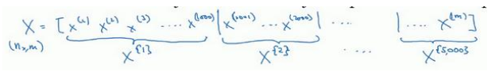
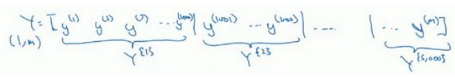
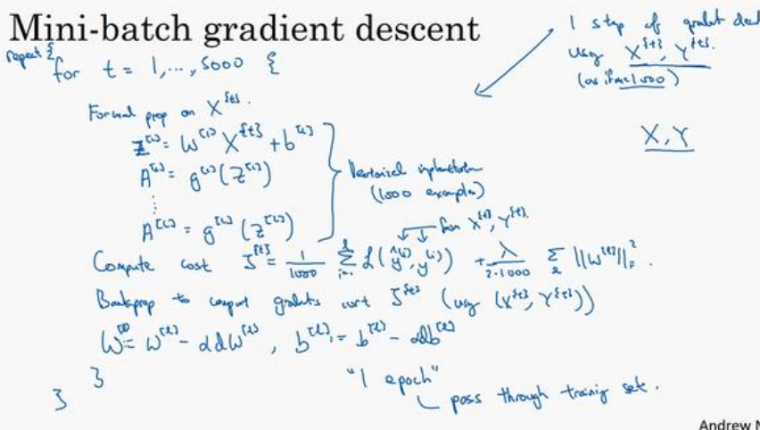
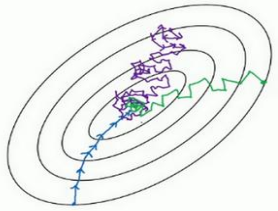

在我之前的文章中, 我们通过向量化, 将m个样本一次性作为输入来训练神经网络, 但是随着输入的训练集数量的增加, 神经网络的计算速度也随之下降.  例如我们的训练集合有 500 万个样本, 想要一次性作为神经网络的输入, 无论是从硬件开销还是时间开销的角度看, 都是不太现实的. 为此, 我们引入了 **mini-batch** 这个概念.

## mini-batch 概念

我们把训练集分割成多个小的子集, 这些子集称为mini-batch. 假设mini-batch中有batch-size = 1000个样本, 则 500万个样本需要有5000个mini-batch.  我们用 X^[1] 表示第一个mini-batch, 里面包含样本 x^(1) - x^(1000).其他的样本表示方法类似:

对测试集也采取类似的划分方法:

对于第 t 个mini-batch 我们用 ^[t] 标示, 其他相关数据也一样:

## mini-batch 梯度下降

在训练集上运行 mini-batch 梯度下降算法, 我们要做的是:

用 for t=0 ... t=5000 在循环体内 对 X^[t] 和 Y^[t] **执行一次** 梯度下降算法, 这样当 for 循环执行完毕之后, 就利用了不同的 mini-batch 的数据完成了 5000 次梯度下降, 一次for循环的完整运行就遍历了所有500万个样本一次, 我们把这样的一次遍历称为一个 epoch, 过程如下:

具体点说就是:  在循环体中, 先对 X^[t] 进行正向传播,  再进行一次反向传播, 直到完成5000次for循环, 我们把**这样的一次完整遍历整个数据集全部样本的过程称为1 epoch**. 如果你想多次遍历训练集合, 那么就需要在for循环外面再嵌套一层循环.

## 理解 mini-batch 梯度下降算法

首先看看 batch 和 mini-batch 梯度下降过程成本函数值的图像:

使用 batch 梯度下降法时，每次迭代你都需要历遍整个训练集，可以预期每次迭代成本都会下降.

而mini-batch 梯度下降过程中,  X^[t] 和  Y^[t] 都是不同的, 因此成本函数 J^[t] 的取值也会各不相同, 但神经网络总归还是在对同一类数据进行训练, 所以成本函数 J 总体上还是趋于下降的趋势.

## mini-batch 的不同取值

1. 如果mini-batch只有一个, 也就是 batch-size = m = 等于样本总数, 那么 mini-batch 梯度下降就变成了我们原来的batch梯度下降了, 会造成每次迭代花费时间过长的问题. 梯度下降过程如下图蓝色的线所示
2. 如果 batch-size = 1, 则变成了 "随机梯度下降",这么做的话, 每次只训练一个样本, 损失了向量化带来的加速效果.  另外, 大部分时候, 它都向着全局最小的点前进, 但是有时候因为样本存在的噪点而偏离最小值.  梯度下降过程如下图紫色的线所示
3. 综上所述, batch-size 的值一般取介于 1 到 m 之间的数, 并且有以下原则: 取2的整数次幂, 一般是 64, 128, 256, 512 中的一个数. 梯度下降过程如下图绿色的线所示

 mini-batch 可以让算法运行的更快, 特别是在样本数量较多的情况下, 不过还有更高效的算法, 后面会陆续发布相关文章~

