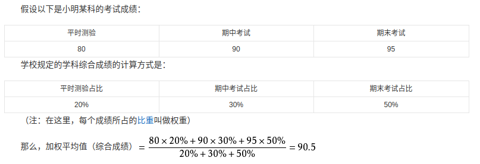
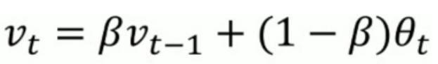
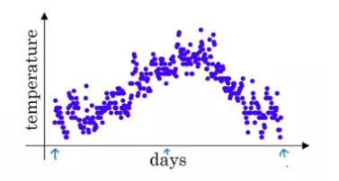
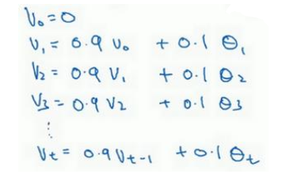

加权平均值, 这个好理解, 就不解释了,贴上一个百度百科的图会意一下:

那, 什么是 指数加权平均值 呢?

直接看公式:

假设我们观察了 T 组的数据, 那么第 t 次的指数加权平均值为:

式子中的参数:

1. V\_t: 第 t 次的指数加权平均值, 可以理解为 **从一开始到第 t 次观测为止** 的所有观测值的平均值
2. v\_(t-1) 可以理解为 **从一开始到第 t-1 次观测为止** 的所有观测值的平均值
3. θ\_t : 第 t 次的**实际观测值**
4. β 是在计算 V\_t 时用于平衡 v\_(t-1)  和 θ\_t 的参数, 在神经网络中是一个超参数. 当 β 越大, 则V\_t就越依赖于前几次观测的平均值, 反之,  β 越小, 就越依赖于当前的实际观测值

这么说可能比较抽象, 下面用具体的例子来明.

假如我们有一组天气的数据, 横轴是时间, 纵轴是温度:

我们可以用指数加权平均值来大致反映天气的变化走势, 设置 β = 0.9 , V\_0 = 0 , 则有:

用图像将 到第t天为止的平均温度 V\_t 表示出来:

可以看到 V\_t 的图像可以表现出温度变化的趋势,  因此我们也可以把 V\_t作为当前时间的估计值.

指数加权平均值本质就是以指数式递减加权的平均, 各数值的权值而随时间而指数式递减, 越近期的数据加权越重，但较旧的数据也给予一定的加权,  最终得到的v\_t表现为波动较小. 

对权重影响最大的参数是 β ,越接近1表示对当前抽样值的权重越高, 对过去测量值得权重越低, 估计值(器)的时效性就越强, 反之, 越弱.

小结:

用**指数加权平均值**  V\_t 来表示数据的好处在于:

1. 表现出数据变化的趋势
2. **可以抚平波动**, 在图像上表现为曲线更加平滑
3. 由于V\_t 是地推定义的, 因此我们计算 V\_t 只需要保存前一次的数据 V\_(t-1), 然后带入最新的数据θ\_t,  不断覆盖 V\_t 即可计算之后的指数加权平均值. 这么计算平均值也许不是那么准确, 但是不必保存所有从 第1次到第 t 次的数据来求平均值, 大大**节省了内存的开销**

利用以上特性, 我们可以把指数加权平均应用到梯度下降算法中, 达到加快梯度下降的作用, 详细内容见我后续发表的文章.

> 参考链接:
>
> https://www.jianshu.com/p/41218cb5e099
>
> https://testerhome.com/topics/10996
>
> https://zhuanlan.zhihu.com/p/29895933