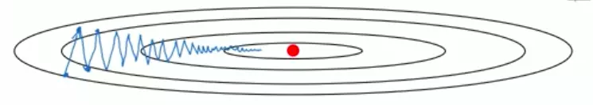

假设下图中红点是最低点，周围的椭圆是自内而外递增的等高线：

而图中波动起伏蓝色折线，则是实际训练过程中梯度下降可能走过的路径。(原因也许是:  成本函数的实际立体图像可能不是个完美的”碗状“，而是沿着不同的方向一步一步的进行阶梯式的下降，最终达到最低点。) 

如果我们可以减少图中纵向的波动，就可以缩短梯度下降过程中经过的路径长度，更具有目的性的朝向预期的最低点走去，如下图红色折线所示：

我们上一篇文章[神经网络优化之指数加权平均](https://www.zxxblog.cn/article/116) 介绍了指数加权平均可以减少数据的波动，如下图红色折线所示：

这篇文章要说明的动量梯度下降法(Momentum) 就是利用了指数加权平均的特性来加快梯度下降速度。

在梯度下降中运用指数加权平均，要做的就是在每次更新dW和db之前，求出 v\_dW 和 v\_db ，如下图红框部分所示：

然后在更新参数的时候(图中蓝色框内部分)，用v\_dW 和 v\_db 取代原先公式中使用的 dW 和 db，这样就可以在每次梯度下降的过程中，减少摆动的幅度了。

式子中的 β 是个超参数，如何取值，我们在后面会发布超参数优化的文章，欢迎围观。

另外，如何理解”动量“呢？看到 CSDN上的一篇文章，说的很形象：

> 每次更新参数时用到的梯度不再只是我现在的数据的梯度，而是有一定权重的之前的梯度，就我个人认为，就像是把原本的梯度压缩一点，并且补上一个之前就已经存在的“动量”。
>
> 举个例子，如果你站在一个地方不动，让你立刻向后转齐步走，你可以迅速向后转然后就向相反的方向走了起来，批梯度下降和随机梯度下降就是这样，某一时刻的梯度只与这一时刻有关，改变方向可以做到立刻就变。而如果你正在按照某个速度向前跑，再让你立刻向后转，可以想象得到吧，此时你无法立刻将速度降为0然后改变方向，你由于之前的速度的作用，有可能会慢慢减速然后转一个弯。
>
> 动量梯度下降是同理的，每一次梯度下降都会有一个之前的速度的作用，如果我这次的方向与之前相同，则会因为之前的速度继续加速；如果这次的方向与之前相反，则会由于之前存在速度的作用不会产生一个急转弯，而是尽量把路线向一条直线拉过去。
>
> 这就解决了文中第一个图的那个在普通梯度下降中存在的下降路线折来折去浪费时间的问题。
>
> 作者：加勒比海鲜王 
> 来源：CSDN 
> 原文：https://blog.csdn.net/yinruiyang94/article/details/77944338 
> 版权声明：本文为博主原创文章，转载请附上博文链接！

在此对作者表示感谢～

另外，由于存在”惯性“，所有在梯度下降遇到局部最低点的时候，由于动量的存在，更容易冲出局部最低点，进一步靠近全局最低点。

除此之外，还有一些加快梯度下降的算法，比如 RMSprop， Adam 等，我会陆续介绍～

