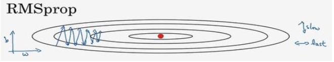
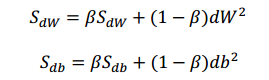
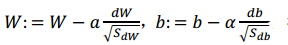
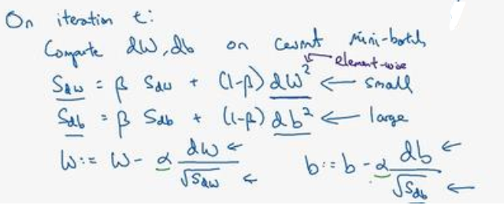
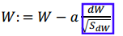
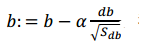
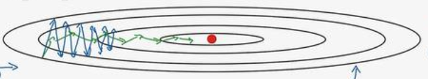
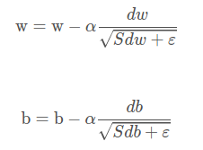

上一篇文章，我们知道了Monmentum算法可以加快梯度下降，而这一篇介绍的RMSprop算法也可以达到类似的效果，首先看看下面这张图，我们**假设参数b代表纵轴，W代表横轴**，注意，这样的假设只是为了方便展开说明，实际上的图像不是这样的，因为W是个多维度的向量，而 b 也未必是纵轴。如下图所示：

Monmentum 的做法是减少纵向的波动，而RMSprop算法在减少纵向波动的同时，还可以加快 (至少不是减少) 横向的学习速度。

做法是在第 t 次迭代的时候，我们需要计算梯度平方的指数平均，其中β是超参数：

注意公式中是对dW求平方以及对db求平方。然后利用两个变量更新参数：

整个过程就是：

接下来我们来理解下为什么这么做。

第一，在更新W时：

它做的就是将 dW 除以 S_dW 的平方根。假如 dW 比较小(在本例子中表现为**斜率在横轴方向的分量比较小**)，那么分分母 sqrt(  S_dW ) 也相应的会比较小。将dW除以一个比较小的数，得到的值就比较大，于是根据公式可知，一定程度上加快了W更新的幅度，在图像中表现为**斜率会更偏向于最低点所在的方向**。

第二，在更新参数 b 时：

斜率在纵轴方向的分量比较大，所以分母sqrt(  S_db) 就比较大，结果就是抑制了b的大幅度更新，在图像中的表现为纵向的波动幅度减小了。

综合上面两点，我们可以得到下面图像中绿色的折线：

显然梯度下降的速度可以得到加快。另外还有一些小细节值得一提：

1, 为了避免除以0的情况发生，通常会在分母加上一个常数ε (程序中用epsilon表示)，一般取值为 10^(-8)，最后公式变为：

2, 应用RMSprop后，我们可以使用更多的学习率，而不用太担心在纵轴方向上的偏离。

Monmentum 和 RMSprop 都是表现良好的加快梯度下降的方法，如果将二者结合起来，就可以得到Adam算法，具体内容，在下一篇文章会说明。