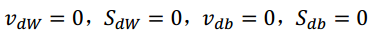
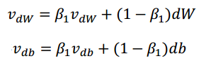
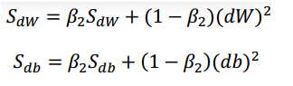
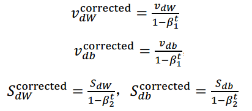
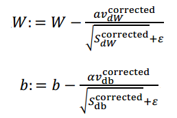
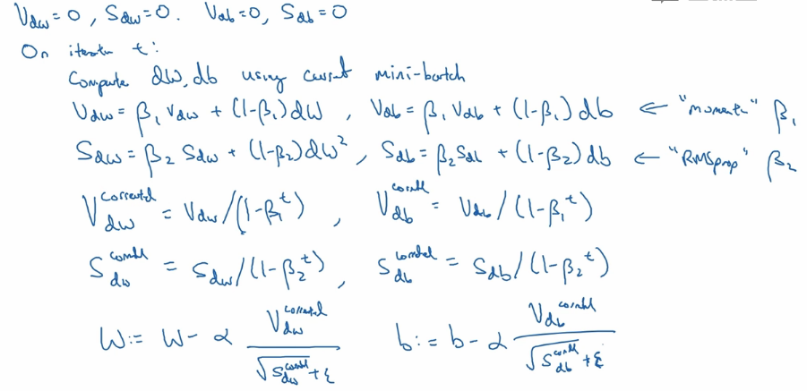

Adam 优化算法本质上就是 Momentum 和 RMSprop 的结合，关于这两个算法，我们之前都已经有所介绍：

- [优化梯度下降算法之动量梯度下降法(Momentum)](https://www.zxxblog.cn/article/117)
- [优化梯度下降算法之RMSprop](https://www.zxxblog.cn/article/118)

那么现在来看看怎么使用 Adam 算法：

首先，做如下的初始化：

然后用当前的 mini-batch 计算出 dW 和 db

接下来计算 Momentum 指数加权平均数：

公式里使用 β\_1 是为了和下面RMSprop公式中用到的 β\_2 相互区分：

一般运用 Adam 算法的时候，我们还要对 v 和 S 的偏差进行修正：

然后就是权重的更新：

完整的过程如下图所示：

Adam 中涉及多个超参数，实际应用中以下超参数都有推荐使用的值：

1.  β\_1 常用缺省值为 0.9
2. β\_2 常用缺省值为 0.999
3. ε 常用缺省值为 10^(-8) 

有了 Adam 优化算法，我们可以更快的训练神经网络了。

