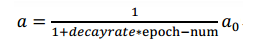
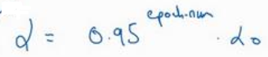
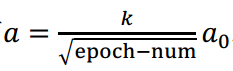
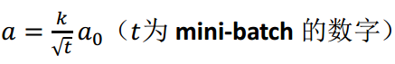

除了之前介绍的方法，还可以通过学习率衰减来加快训练的速度简单来说就是：一开始设置较大的学习率来加快学习速度，然后逐渐减小学习率，使得最终训练出来的模型能够收敛于最低点。

假设我们使用 mini-batch 梯度下降，那么具体做法如下：

- decayrate 是衰减率，是一个超参数。
- epoch-num 表示第几次完整遍历数据集，可以理解为代数。（1 epoch 称为 1代）
- α_0 为初始学习率。

可以看到，随着代数的增加，分母也随之增加，学习率也就逐步减小。

还有其他的学习率衰减的公式可以选择：

当然，上面的都是由程序来完成学习率的衰减工作，也可以手动调整学习率。