对数据进行归一化操作，可以加快模型的收敛速度，还可以让神经网络对超参数的选择更加稳定，优化模型的表现能力。

## 输入归一化

假设我们的神经网络不是很复杂，并且数据分布如下：

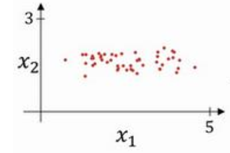

归一化的步骤分为：1. 零均值化, 2. 归一化方差。

### 1. 零均值化

首先计算各个输入样本的平均值:

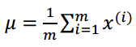

然后每个样本 x 都减去 μ，经过这样的处理，每个样本的两个特征就会相对集中的分布在原点附近，这样就完成了零均值化。如图所示：

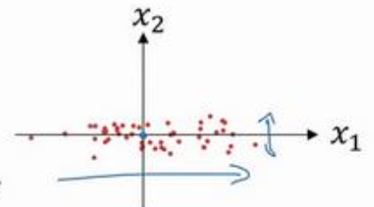

### 2. 归一化方差

第二步是归一化方差，注意到上图中，特征 x1 的方差比特征 x2 要大的多，为了让数据分布的更均匀，我们要计算：

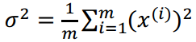

然后把第一步零均值化后得到的样本再除以 σ^2，这样就完成了归一化方差，数据分布如图所示：

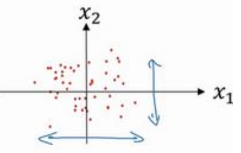

经过归一化的操作，得到的图像会在坐标中分布的更加均匀，并且都相对集中在原点附近。

简单来说，**归一化要做的就是减均值除方差**。

### 为什么归一化

先回顾下我们的成本函数：

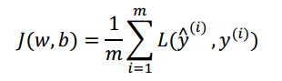

假设我们输入的样本的特征取值范围特别大，比如从-1000到1000，那么 w 的取值也将会因为特征大小的不同而不同。对于小的特征，权重的值可能比较大，对于大的特征，权重取值可能比较小，最后得到的成本函数图像就不会是均匀的图像，比如：

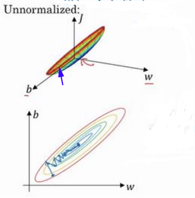

如果从图中蓝色的箭头处进行梯度下降，可能会因为在w方向上的斜率比较大，而造成反复在w方向上来回波动。

经过归一化的成本函数因为w的取值更加的均匀，所以分布图像如下所示：

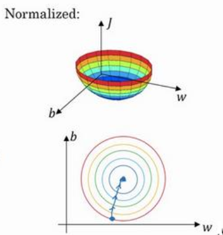

这样无论从哪个点开始梯度下降，都能朝着最小值点前进，显然加快了训练的速度。

## 批归一化(Batch Normalization)

上面提到的输入归一化也有不足的地方：随着隐藏层数量的加深，输入数据的归一化的效果就逐层减少了，以至于后面每一层的数据分布都是一直在发生变化的。

批归一化(Batch Normalization)，简称BN，将你的数据以 mini-batch 的形式逐一处理，对每一个隐藏层的输入a[l-1]进行归一化操作。严格来说，**真正归一化的不是a[l - 1]，而是z [l - 1]**。因为 z 是作为激活函数的输入，z 归一化后的值容易落在激活函数 sigmoid 和 tanh 中梯度较大的部分，有利于进行梯度下降。

要得到归一化的 z 需要三步：

1, 求某一层所有mini-batch中样本 z^(i) 的均值( i 取值为从1到 batch-size)。2, 利用均值求方差。3, 将第i个样本的 z^(i) 减去均值后除以方差，得到 z_norm^(i)。公式如下：

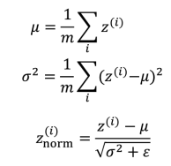

注：ε是为了避免分母为0而加进去的接近于0的数 。

减均值除方差得到的分布是正态分布，但是对每一层的数据而言，正态分布未必就是最好的，为了让神经网络经过训练得到适合自己的分布，我们引入两个参数 γ 和 β， 公式调整为：

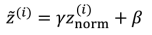

引入这两个参数的原因可以这么理解，比如我们使用sigmoid函数作为激活函数，如果每一层的数据都恰好落在函数图像的线性部分，那么每一层都对数据进行近似线性变换，也就损失了sigmoid函数非线性的表达能力了，为了减少这样的情况发生，我们设置这两个超参数，让神经网络学习适合自己的分布。

另外，当有以下特殊条件时：

就可以得到：

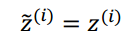

将BN应用到神经网络中可以得到：

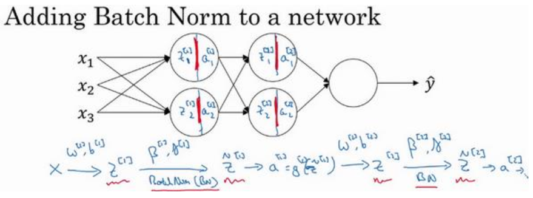

每层都将归一化的 z 作为激活函数的输入，得到 a ，然后再作为下一层的输入。参数 γ 和 β 则在反向传播中应用梯度下降学习到合适的值。

## 测试时的批归一化

训练时，我们对 mini-batch 中所有样本的 z^(i) 求平均值和方差然后进行归一化，但是测试时，我们的测试样本在部分情况下可能只有 1 个，这时候一个样本的均值和方差就没有意义。实际上，在测试时，需要单独计算均值和方差。

实际操作中，我们运用指数加权平均来追踪训练过程中得到的均值和方差，这个平均数涵盖了所有 mini-batch：

假设我们有 m 个 mini-batch，用^{ t }来表示第 t 批次，那么在第 l 层我们可以得第 t 个 mini-batch 总共batch-size个 z 的均值 μ^{ t }^[ l ] ，以及其他mini-batch的均值：

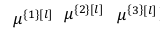

我们用 μ 表示第 l 层总共 m 个均值的指数加权平均值，作为这一层的均值的估计值。

同理可以得到第 l 层总共 m 个方差的指数加权平均值，用 σ^2 表示，并作为这一层方差的估计值。

然后根据这两个估计值，以及该层计算出来的z求得下面变量的值，其中，β、γ为神经网络模型已经训练好的参数：

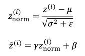

这样该层归一化后的z就能求出来了，将其经过激活函数处理，传给下一个隐藏层....

总结一下就是：在测试时，首先根据训练集获得不同mini-batch的μ和σ^2，然后计算指数加权平均数 ,然后在测试中使用μ和σ^2 的指数加权平均数来进行你所需要的隐藏单元z值的调整。

参考文章：

[神经网络—从输入归一化到batch归一化](http://zyzblog.top/article/24)