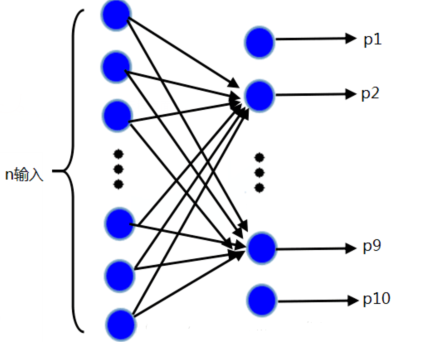
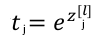
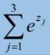
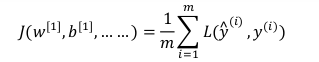

之前我们将的神经网络模型都是用于二分类的情况，如果我们希望预测结果可以有多个类别，那就需要**在最后一层使用 Softmax 激活函数**，其他层的数据的计算方法不变。

使用了Softmax函数的神经网络输出层神经元的个数有多个 ，如下图所示；

每个单元代表一个类别，并输出一个概率值 p，且所有概率之和等于1。p 的值越大说明属于该类别的可能性越大。具体概率值是怎么计算的，看看下面这张图片，然后我将展开叙述：

为了方便说明，我们假设神经网络只输入了一个样本。

由最后一层的输入 A^[L-1]计算出 Z^[L]，上图中的Z^[L] 是一个列向量，包含z_1，z_2，z_3。

Softmax 激活函数要做的就是：

第一步，对第 l 层的每个单元 计算以 e 为底， z_j 为指数  的值记为 t\_j，公式如下：

第二步，将该层所有的 t 累加起来，得到下面的值记为 T：

第三步，第 j 个单元输出   以 t_j 为分子，以 T 为分母  得到的值：

最终的输出值便是各个单元所对应的类别的概率值，可以看到 y1 的概率最大，该分类的结果可能是类别1。

Softmax 的思想大致如上面所属，至于为什么要对 e 取指数：

1. 要模拟max的行为，所以要让大的更大。

2. 需要一个可导的函数来进行梯度下降。

在多分类模型中，我们对单个样本使用的损失函数是：

而对所有样本而言，使用的成本函数为：

神经网络模型根据上述公式进行梯度下降，使得成本函数值达到最小。