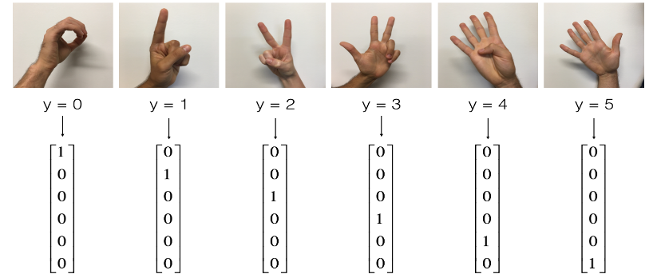
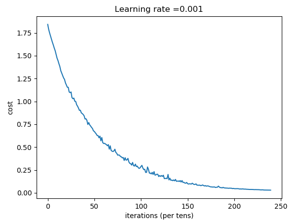

本文将简单介绍下如何使用 tensorflow 搭建神经网络模型，以及完成简单的手势识别的任务：



在开始之前，先引入需要用到的库：

```python
import math
import numpy as np
import matplotlib.pyplot as plt
import tensorflow as tf
from tensorflow.python.framework import ops
from tf_utils import load_dataset, random_mini_batches, convert_to_one_hot, predict
```

本文中的部分辅助函数在 tf_utils.py 中，tf_utils.py 以及 本文用到的数据集和完整代码下载地址：[点此进入](https://github.com/zxxwin/DLnote/tree/master/python%20code/tensorflow)

## 1.创建 placeholder 用于接收数据集的数据

以下函数用于返回用于保存 X 和 Y 的placeholder。

- n_x 为样本的特征个数，比如 64\*64\*3=12288
- n_y 为类别的个数，在本文中类别为 6 个

函数的作用可以理解为在tensorflow的计算图中声明两个二维的变量 X 和 Y，在执行的时候，再赋值。

其中第二个维度表示样本的个数，这里设置为None表示数不指定，待输入数据后自动确定。这样可以增加他们的灵活性，因为输入的训练集和测试集的个数不一样。

```python
def create_placeholders(n_x, n_y):
    X = tf.placeholder(tf.float32, [n_x, None])
    Y = tf.placeholder(tf.float32, [n_y, None])
    
    return X, Y
```

## 2.初始化神经网络的参数

我们打算用3层的神经网络模型，两个隐藏层的单元个数分别为25和12，输出层6个单元。

我们用 Xavier 初始化权重W，用 0 初始化 b ：

```python
def initialize_parameters():
    # 为了让每次运行时随机生成的值都是固定的，用1作为seed
    tf.set_random_seed(1)
    
    W1 = tf.get_variable("W1", [25, 12288], initializer=tf.contrib.layers.xavier_initializer(seed=1))
    b1 = tf.get_variable("b1", [25, 1], initializer=tf.zeros_initializer())
    W2 = tf.get_variable("W2", [12, 25], initializer=tf.contrib.layers.xavier_initializer(seed=1))
    b2 = tf.get_variable("b2", [12, 1], initializer=tf.zeros_initializer())
    W3 = tf.get_variable("W3", [6, 12], initializer=tf.contrib.layers.xavier_initializer(seed=1))
    b3 = tf.get_variable("b3", [6, 1], initializer=tf.zeros_initializer())

    parameters = {"W1": W1,
                  "b1": b1,
                  "W2": W2,
                  "b2": b2,
                  "W3": W3,
                  "b3": b3}
    
    return parameters
```

## 3.进行正向传播

在tensorflow中：

- `tf.add(...,...)` 用来执行加法
- `tf.matmul(...,...)` 用来执行矩阵乘法
- `tf.nn.relu(...)` 用来执行 relu 激活函数

```python
def forward_propagation(X, parameters):
    # 取出参数
    W1 = parameters['W1']
    b1 = parameters['b1']
    W2 = parameters['W2']
    b2 = parameters['b2']
    W3 = parameters['W3']
    b3 = parameters['b3']
    
    Z1 = tf.add( tf.matmul(W1, X), b1 )
    A1 = tf.nn.relu(Z1)
    Z2 = tf.add( tf.matmul(W2, A1), b2 )
    A2 = tf.nn.relu(Z2)
    Z3 = tf.add( tf.matmul(W3, A2), b3 )
    
    return Z3
```

注意，我们在最后一层只需要算到Z3即可，因为在tensorflow中，最后一层的Z是作为计算loss的函数的输入，并在该函数中完成激活函数的计算。

## 4.计算成本函数

我们利用函数softmax_cross_entropy_with_logits来完成softmax的工作，并计算交叉熵，reduce_mean 用于将所有元素求和并取平均值。

softmax_cross_entropy_with_logits中的logits本质上就是我们的 Z3，labels就是我们的Y，只不过要求这两个参数的shape为(样本的个数，类别的个数)，因此需要对我们的 Z3 和 Y 进行转置。

```python
def compute_cost(Z3, Y):
    logits = tf.transpose(Z3)
    labels = tf.transpose(Y)
    
    cost = tf.reduce_mean(tf.nn.softmax_cross_entropy_with_logits(logits=logits, labels=labels))
    
    return cost
```

## 5.使用optimizer

tensorflow 中，我们只需要实现正向传播，定义损失函数即可，tensorflow利用optimizer帮你接管了所有反向传播和参数更新的工作。我们要做的就是在计算cost的函数的下一行调用下面的代码来优化我们的cost：

```
optimizer = tf.train.GradientDescentOptimizer(learning_rate = learning_rate).minimize(cost)
```

并且在获得session后执行这个操作：

```
sess.run([optimizer, cost], feed_dict={X: minibatch_X, Y: minibatch_Y})
```

具体的会在下面定义完整的神经网络模型函数中看到如何使用。

## 6. 建立完整的神经网络模型函数

利用之前的函数，构建完整的神经网络模型函数：

```python
def model(X_train, Y_train, X_test, Y_test, learning_rate = 0.001, num_epochs = 1200, minibatch_size = 32, print_cost = True):
    tf.set_random_seed(1)
    seed = 3
    (n_x, m) = X_train.shape
    n_y = Y_train.shape[0]
    costs = []
    # 为 X Y 创建 placeholder
    X, Y = create_placeholders(n_x, n_y)

    # 初始化参数
    parameters = initialize_parameters()
    
    # 正向传播
    Z3 = forward_propagation(X, parameters)

    # 计算成本函数    
    cost = compute_cost(Z3, Y)
    
    # 创建优化器
    optimizer = tf.train.GradientDescentOptimizer(learning_rate=learning_rate).minimize(cost)
    
    # 初始化所有变量的操作
    init = tf.global_variables_initializer()

    # 运行计算图
    with tf.Session() as sess:
        
        # 进行初始化
        sess.run(init)
        
        # 执行训练
        for epoch in range(num_epochs):

            epoch_cost = 0.
            # 得到mini-batch的数量
            num_minibatches = int(m / minibatch_size)
            seed = seed + 1
            # 随机获取一组mini-batch
            minibatches = random_mini_batches(X_train, Y_train, minibatch_size, seed)

            for minibatch in minibatches:

                (minibatch_X, minibatch_Y) = minibatch
                
                # 执行优化器的操作，并返回cost。对于不想保留的返回值，我们用 _ 来占位
                _ , minibatch_cost = sess.run([optimizer, cost], feed_dict={X: minibatch_X, Y: minibatch_Y})
                
                epoch_cost += minibatch_cost / num_minibatches

            # 打印cost
            if print_cost == True and epoch % 100 == 0:
                print ("Cost after epoch %i: %f" % (epoch, epoch_cost))
            if print_cost == True and epoch % 5 == 0:
                costs.append(epoch_cost)
                
        # 绘制 cost 走势
        plt.plot(np.squeeze(costs))
        plt.ylabel('cost')
        plt.xlabel('iterations (per tens)')
        plt.title("Learning rate =" + str(learning_rate))
        plt.show()

        # 保存参数
        parameters = sess.run(parameters)

        # 返回一个元素值为 True 或者 False 的矩阵
        # tf.argmax(Z3) 返回Z3数据中最大值对应的下标，也就是预测的类别
        # 与Y中对应的类别加以比较，若对应位置的值相同，则返回的矩阵中该位置的值为 True
        correct_prediction = tf.equal(tf.argmax(Z3), tf.argmax(Y))

        # 将值为 True 和 False 的矩阵转换为浮点数矩阵，并计算平均值，就得到了准确度
        accuracy = tf.reduce_mean(tf.cast(correct_prediction, "float"))

        # 下面的语句和这一句等价：print("Train Accuracy:", sess.run(accuracy, {X: X_train, Y: Y_train}))
        print ("Train Accuracy:", accuracy.eval({X: X_train, Y: Y_train}))
        # 下面的语句和这一句等价：print("Test Accuracy:", sess.run(accuracy, {X: X_test, Y: Y_test}))
        print ("Test Accuracy:", accuracy.eval({X: X_test, Y: Y_test}))
        
        return parameters
```

到这里就完成了用 tensorflow 构建一个3层的多分类的神经网络模型，接下来我们来进行训练和测试。

## 训练和测试

```python
# 载入数据
X_train_orig, Y_train_orig, X_test_orig, Y_test_orig, classes = load_dataset()

# 为输入的数据进行预处理
X_train_flatten = X_train_orig.reshape(X_train_orig.shape[0], -1).T
X_test_flatten = X_test_orig.reshape(X_test_orig.shape[0], -1).T
# 规范化数据
X_train = X_train_flatten/255.
X_test = X_test_flatten/255.
# 将数据转换成 one-hot 形式
Y_train = convert_to_one_hot(Y_train_orig, 6)
Y_test = convert_to_one_hot(Y_test_orig, 6)

# 运行我们的模型
parameters = model(X_train, Y_train, X_test, Y_test)
```

得到的输出结果如下：

> Cost after epoch 0: 1.842589
>
> Cost after epoch 100: 1.180128
>
> Cost after epoch 200: 0.807935
>
> Cost after epoch 300: 0.539924
>
> Cost after epoch 400: 0.382261
>
> Cost after epoch 500: 0.289114
>
> Cost after epoch 600: 0.189329
>
> Cost after epoch 700: 0.130603
>
> Cost after epoch 800: 0.084355
>
> Cost after epoch 900: 0.058830
>
> Cost after epoch 1000: 0.046503
>
> Cost after epoch 1100: 0.037426
>
> 
>
> Train Accuracy: 0.999074
>
> Test Accuracy: 0.883333

