## 全连接神经网络的局限性

过去的文章中，我们都是对 64×64 的小图片进行操作，实际上，因为每张图片都有 3 个颜色通道，它的数据量是 64×64×3=12288。

现代计算机中，64×64 真的是很小的图片，如果想处理大一点的图片，比如1000×1000，那么最终输入层的数据量是300万，假设我们有一个隐藏层，含有1000个神经元构成的全连接网络，那么数据量将达到 1000*300万，也就是30亿。在这样的情况下很难获得足够的数据防止过拟合，并且需要的内存大小很难得到满足。

本篇讲解的卷积神经网络（也称作 **ConvNets** 或 **CNN**）不仅可以达到减少参数的作用，而且在图像分类任务中还有其他优于全连接神经网络的特性。

## 卷积神经网络概览

一个图像的相互靠近的局部具有联系性，卷积神经网络的思想就是用不同的神经元去学习图片的局部特征，**每个神经元用来感受局部的图像区域**，如下图圆圈所示：

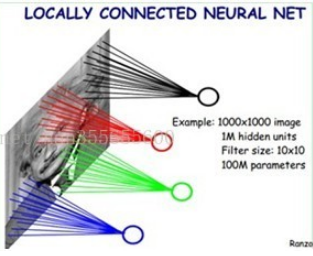

然后在更高层，将这些感受不同局部的神经元综合起来就可以得到全局的信息了。

卷积神经网络与普通神经网络的区别在于，卷积神经网络包含了由**卷积层**和**子采样层**构成的特征抽取器，并且在最后有几个**全连接层**用于对提取的特征进行分类。一个简单的卷积神经网络模型如下：

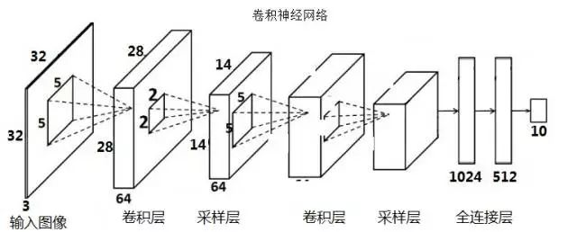

接下来我们展开讲解这几个层具体都在做什么。

## 卷积层

卷积层主要做的就是卷积运算操作，本文用 “\*” 表示卷积。

### 卷积运算

下图的左边6*6的矩阵是一个灰度图，右边3×3的矩阵我们称之为过滤器(filter)，卷积运算表达式如下：

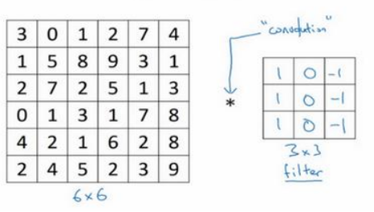

卷积的第一步就是将过滤器覆盖在灰度图左上角，如下图蓝色部分：

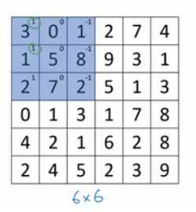

蓝色矩阵每个小格子的左上角的数字就是过滤器对应位置上的数字，将每个格子中的两个数字相乘：

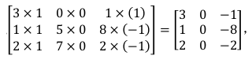

然后将得到的矩阵所有元素相加，即3 + 1 + 2 + 0 + 0 + 0 + (-1) + (-8) + (-2) = -5，然后将这个值放到新的4*4的矩阵的左上角：

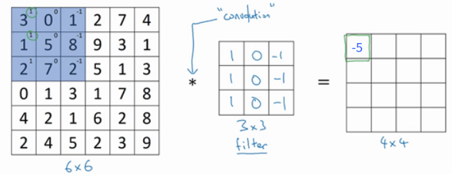

我们以1为步长(stride)向右移动一格，再进行类似的计算：

 0 × 1 + 5 × 1 + 7 × 1 + 1 × 0 + 8 × 0 + 2 × 0 + 2 × (-1) + 9 × (-1) + 5 × (-1) = -4 写在刚刚得到的-5的右边。

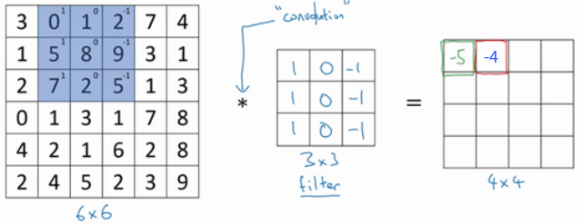

重复向右移动，直到第一行都计算完毕：

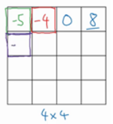

然后将过滤器向下移动一格，从左边开始继续进行计算，得到-10，写在新矩阵的第二行第一个位置上：

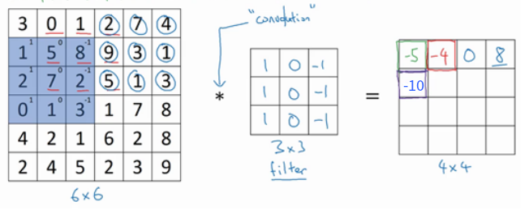

不断的向右向下移动，直到计算出所有数据，这样就完成了卷积运算：

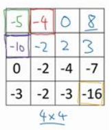

下面这张图也可以帮助你理解卷积运算（黄色的矩阵是过滤器）：

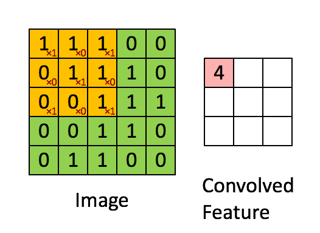

最终经过卷积得到的图像，我们称之为**特征图(Feature Map)**

对于上述过程，也许你有很多疑问，比如过滤器是什么，为什么是3×3的，作用是什么，滑动的步长stride为什么是1，为什么得到4×4的矩阵，卷积有什么作用等，我们一一解答。

### 过滤器(filter)

像这样的矩阵为什么叫过滤器呢？他有什么作用吗？

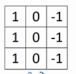

我们来看看下面的例子，本例子中我们用正数表示白色，0表示灰色，负数表示黑色。

左边 6×6 的矩阵是一个灰度图，左半部分是白色，右半部分是灰色。下面的3×3的过滤器是一种垂直边缘过滤器。

对二者进行卷积得到新的矩阵，这个矩阵的中间部分数值大于0，显示为白色，而两边为 0， 显示为灰色。

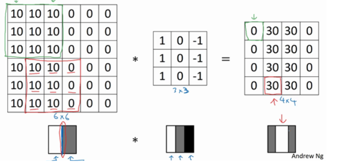

中间的这部分白色竖线就是过滤得到的垂直边缘。咦，等等，哪有这么粗的边缘...？

这是因为我们的灰度图尺寸仅为6×6，太小了，如果我们把灰度图放大一些：

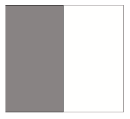

再进行卷积就可以得到：

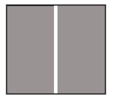

这样就能大致看出过滤器确实过滤出了垂直边缘。如果想得到水平的边缘，将过滤器转置一下即可。而如果想得到其他角度的边缘，则需要在过滤器中设置不同的数值。

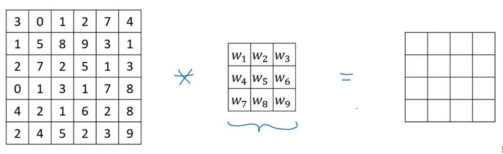

当然很难手动设置过滤器的值去过滤某个特殊角度（比如31°）的边缘，我们通常是**将过滤器中的9个数字当成9个参数**。随机初始化这些参数后，通过神经网络的学习来获得一组值，用于过滤某个角度的边缘。

目前主流网络的过滤器的大小一般是1x1、3x3、5x5等，数值一般不会太大，因为我们希望这些过滤器可以获得一些更细微的边缘特征。另外，一般将长和宽都取奇数，具体原因我们讲到Padding的时候再解释。

### 卷积滑动步长

之前的卷积操作中，我们用 3x3 的过滤器以1为步长卷积 6x6 的图像，得到了4×4的矩阵。

现在我们用 3x3 的过滤器以2为步长卷积 7x7 的图像，看看会得到什么。

第一步，对左上角的区域进行计算：

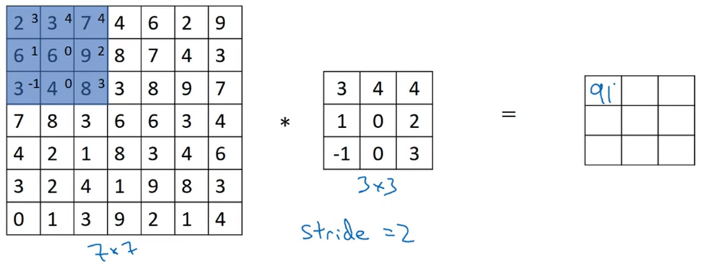

第二步，向右移动两格进行计算：

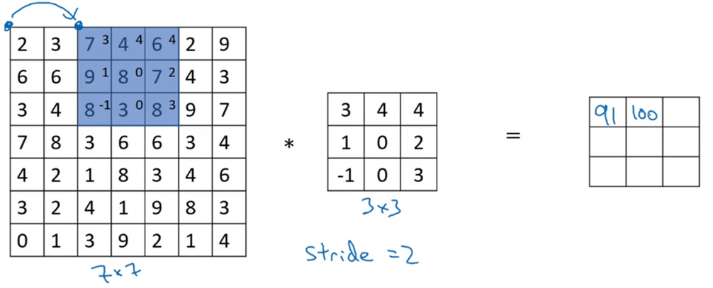

再继续向右向下移动过滤器，就可以得到下面的结果：

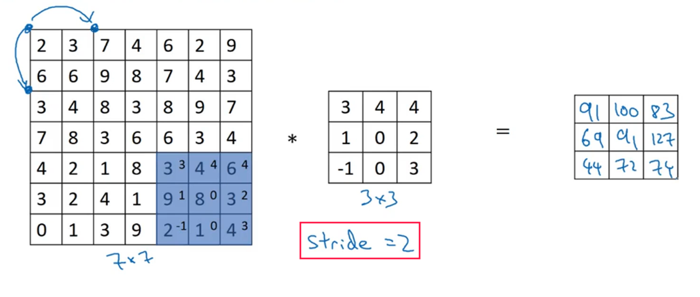

发现最终得到的矩阵大小不一样了，其实最终得到的矩阵的大小由初始图像的尺寸n，过滤器的尺寸f，以及步长s决定。

最后得到的矩阵长度和宽度值的公式为：

> ( n - f ) / s + 1

例如， n=7，f=3，s=2时，可以得到 3x3 的矩阵：

> ( 7 - 3 ) / 2 + 1 = 3

再如， n=6，f=3，s=1时，可以得到 3x3 的矩阵：

> ( 6 - 3 ) / 1 + 1 = 4

取不同的步长意义何在？不同的步长会以不同的精细程度对原始图像进行卷积。s越小，最后提取到的特征也就越多。

上述的卷积过程有两个缺点：

1. 每次卷积之后图像就会缩小。
2. 图片的中间部分进行了多次卷积，而边缘部分的数据则参与卷积的次数较少，意味着你丢掉了图像边缘位置的许多信息。

为了解决这些问题，我们需要在卷积之前对神经网络进行零填充。

### Zero Padding

零填充就是在原来图像的外围填充上0，如下图所示：

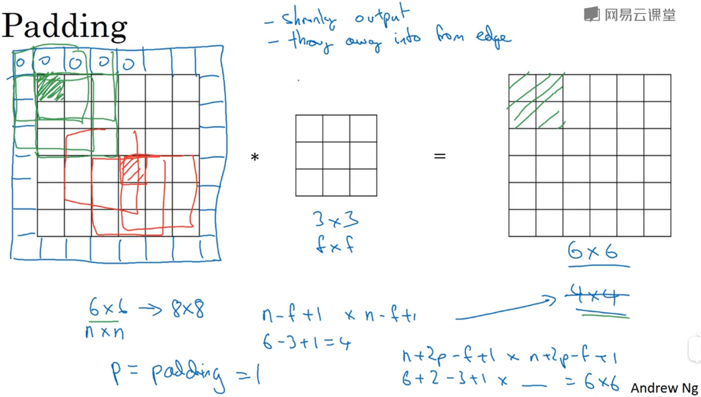

对于 6x6 的图像，我们如果在外围填充 1 层的零变为了 8x8 的图像，那么经过卷积之后就能得到 6x6 的图像了：

> n' = 8
>
> ( n' - f ) / s + 1 = ( 8 - 3 ) / 1 + 1 = 6

即引入 padding 的概念后，设填充的层数量为 p，则一个图像经过卷积之后得到的尺寸为：

> ( n + 2p - f ) / s + 1

那么怎么知道我们需要填充多少层呢？来解个方程就知道了：

> 设填充的层数量为 p，滑动步长 s=1，原图尺寸为n，过滤器尺寸为3
>
> ( n + 2p - f ) / s + 1 = n
>
> 即 (n + 2p -3) + 1 = n
>
> 解得：p = 1
>
> 一般情况下，设步长 s=1，则有：
>
> **p = (f − 1)/2**

根据最后得到的公式可以看到，当 f 是奇数的时候，得到的 p 才会是整数，这样我们才能均匀的在外层填充0。

当然，如果你的图像边缘信息不重要，并且想缩小图像的尺寸，则 p = 0。

### 三维卷积

上面的讲解你已经知道如何对灰度图进行卷积运算了，现在看看如何在有三个通道(RGB)的图像上进行卷积。

假设彩色图像尺寸 6×6×3，这里的 3 指的是三个颜色通道。我们约定图像的通道数必须和过滤器的通道数匹配，所以需要增加过滤器的个数到3个。将他们叠在一起，进行卷积操作，如下图：

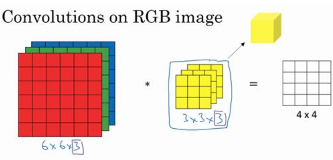

具体过程就是，首先，把这个 3×3×3 的过滤器先放到最左上角的位置，依次取原图和过滤器对应位置上的 各27 个数相乘后求和，得到的数值放到新矩阵的左上角。

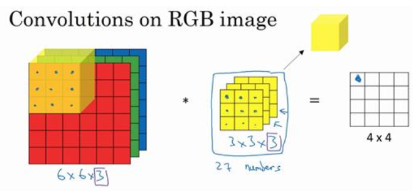

> 注意，由于我们是用三维的过滤器对三维的原图进行卷积操作，所以最终得到的矩阵**只有一维**。

然后不断向右向下进行类似操作，直到“遍历”完整个原图：

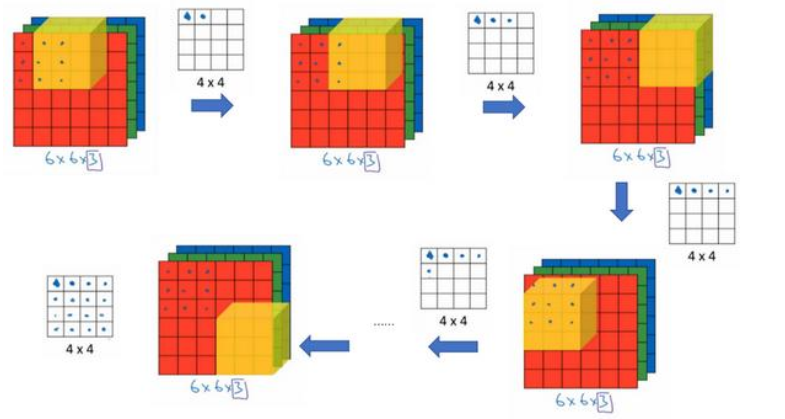

至于效果是怎么样的，结合之前的知识，我们假设使用一组垂直边界过滤器：

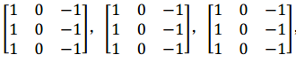

它可以完成RGB三个通道上垂直边缘的检测工作。这也解释了为什么过滤器使用3个通道：也就是说如果你想获得RGB三个通道上的特征，那么你使用的过滤器也得是3个通道的。

如果你除了垂直边界，还想要检测更多的边界怎么办？可以使用更多 3维 的过滤器，如下图框住的部分，我们增加了一组过滤器：

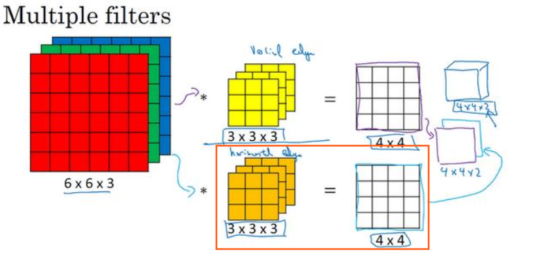

这样，两组过滤器就得到了两组边界，我们一般会将卷积后得到的图叠加在一起，得到上图右上角的 4x4x2 的图像。如果你还想得到更多的边界特征，使用更多的3维的过滤器即可。

现在我们对维度进行总结：

> 使用 n × n × nc 原图和 nc' 个 f × f × fc 的过滤器进行卷积，得到 (n-f+1) × (n-f+1) × nc' 的图像

nc 是 原图的通道数(3)，过滤器的通道数和原图的通道数必须一样，都是 nc。

nc' 是最终得到的图像的通道数，由使用的过滤器个数决定(而 nc' 又是下一层的输入图像的通道数)

### 卷积层全貌

下图就是一个卷积层的全貌了，接下来会展开叙述。

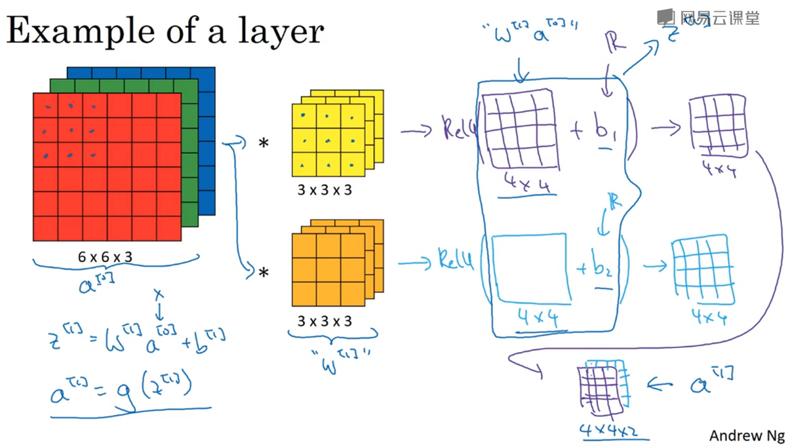

对于卷积层，我们同样需要进行以下操作：

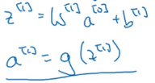

各个变量解释如下：

- a^[0] 是我们原图的数据 X ，也就是上图 6x6x3 的RGB图。
- w^[1] 是这一层的权重矩阵，由 2 个 3x3x3 的过滤器组成。
- b^[1] 是第一层的偏置项，不同的过滤器对应不同的偏置值
- g() 是激活函数，本例子中使用 ReLu

卷积层的工作说明：

式子中 w^[1] * a^[0] 是代表进行**卷积运算**得到两个特征图(也就是2个4x4的矩阵)，如下图红色框所示：

再对两个特征图**加上不同的偏置**就得到了z^[1]，如下图红色框所示：

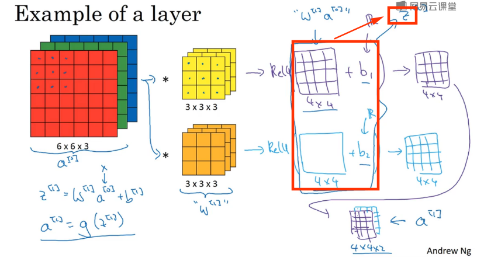

进一步**应用激活函数**就得到了两个处理过的图像，将他们叠加在一起，就得到了这一层的输出 a^[1]，如下图红色框所示：

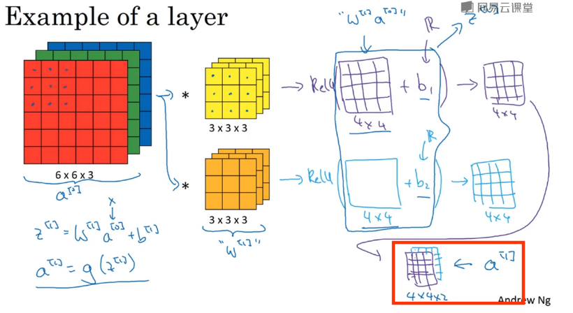

简单来说，卷积层的工作就是：

**将输入的数据a^[l - 1]进行卷积操作，加上偏置，再经过激活函数非线性化处理得到a^[l]**

到这里卷积层的任务就完成了。

### 为什么使用卷积

卷积层的两个主要优势在于稀疏连接和权值共享。

**1. 稀疏连接**

假设我们输入的是32×32×3的RGB图像。

如果是**全连接前馈网络**，对于隐藏层的某个神经元，它不得不和前一层的所有输入（32×32×3）都保持连接。

但是，对**卷积神经网络**而言，神经元只和输入图像的局部相连接，如下图圆圈所示：

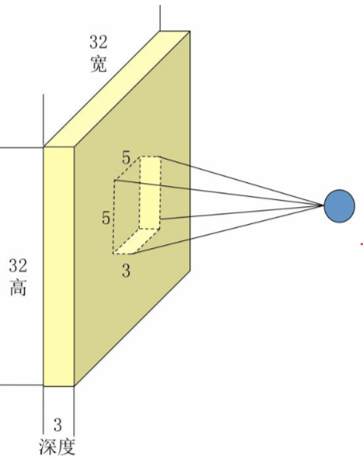

这个局部连接的区域，我们称之为“感受野”，大小等同于过滤器的大小(3\*3\*3)。

相比之下，卷积神经网络的神经元与图像的连接要稀疏的多，我们称之为**稀疏连接**。

**2. 权值共享**（参数共享）

权值共享其实就是过滤器共享。特征检测如垂直边缘检测过滤器如果适用于图片的某个区域，那么它也可能适用于图片的其他区域，如果我们用垂直过滤器扫描整张图片，就可以得到整张图片的所有垂直边缘，而换做水平过滤器就可以扫描出图片的水平边缘：

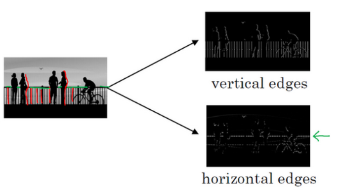

在CNN中，我们用不同的神经元(过滤器)去学习整张图片的不同特征，**而不是  利用不同的神经元  学习图片不同的局部特征**。因为图像的不同部分也可能有相同的特征。

每个特征检测过滤器都可以在输入图片的不同区域中使用同样的参数(即方格内的9个数字)，以便提取垂直边缘或其它特征。右边两张图每个位置是被**同样**的过滤器扫描而得的，所以**权重**是一样的，也就是**共享**。

假设有100个神经元，全连接神经网络就需要32×32×3×100=307200个参数。

因为共享了权值，提取一个特征只需要 f×f 个参数，上图右边两张图的每个像素只与使用 3x3 的过滤器相关，顶多再加上一个偏置项。在本例子中，得到一个feature map 只用到了 3\*3+1=10 个参数。如果想得到100个特征，也不过是用去1000个参数。 

这就解释了为什么利用卷积神经网络可以减少参数个数了。

当你对提取到的 水平垂直或者其他角度 的特征，再进行卷积操作，就可以得到更复杂的特征，比如一个曲线。如果对得到的曲线再进行卷积操作，又能得到更高维度的特征，比如一个车轮，如此往复，最终可以提取到整个图像全局的特征。

> 本部分参考连接：
>
> [【深度学习之美】局部连接来减参，权值共享肩并肩（入门系列之十一）](https://yq.aliyun.com/articles/159710)

------

到这里卷积层的说明就结束了，附上一张动图帮助你理解：

## 采样层(Pooling Layer)

对于一个32x32像素的图像，假设我们使用400个3x3的过滤器提取特征，每一个过滤器和图像卷积都会得到含有 (32-3 + 1) × (32 - 3 + 1) = 900 个特征的feature map，由于有 400 个特征，所以每个样例 (example) 都会得到 900 × 400 = 360000 个特征。而如果是96x96的图像，使用400个8x8的过滤器提取特征，最终得到一个样本的特征个数为 316 8400。对于如此大的输入，训练难度大，也容易发生过拟合。

为了减少下一个卷积层的输入，引入了采样层(也叫池化层)，对当前层的输出进行下采样操作，右边的矩阵是采样的结果：

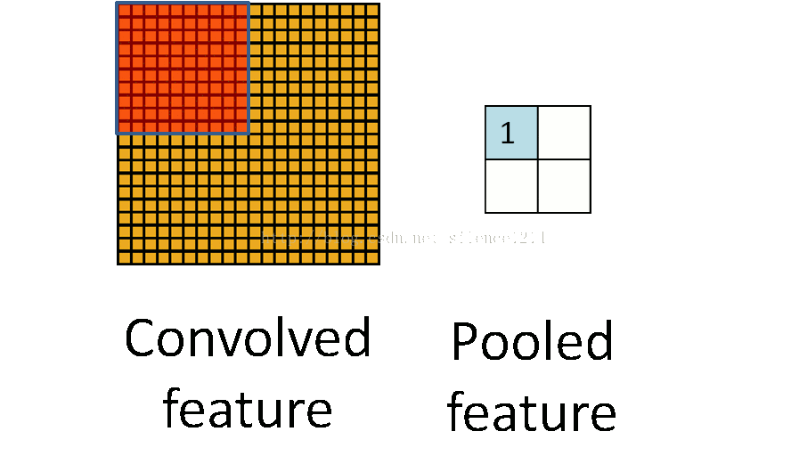

采样操作分为最大值采样(Max pooling)，平均值采样(Mean pooling)。

**最大值采样**

举个例子，我们用3x3的过滤器 以1为步长 去扫描图像，每次将重叠的部分的最大值提取出来，作为这部分的特征，过程如下：

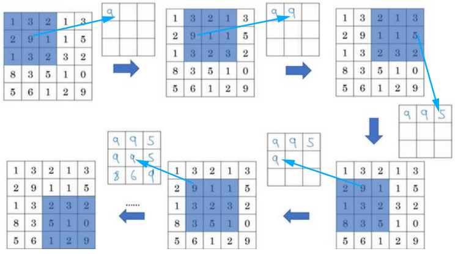

最终得到的图像又比原来尺寸要小了，最终得到的图像尺寸计算方法和卷积过程类似。

实际上比较常见的最大值采样是用 2x2 的过滤器，以2为步长进行特征值提取，最终得到的图像长度和宽度都缩小一半：

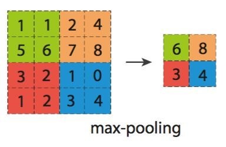

**平均值采样**

与最大值采样不同的是  将覆盖部分特征的平均值作为特征，其他过程都一样。

经过采样处理，可以提取更为抽象的特征，减少数据处理量的同时保留有效信息。

## 全连接层

在经过几次卷积和池化的操作之后，卷积神经网络的最后一步是全连接层，全连接层的个数可能不止一个：

**最后一个采样层到全连接层的过渡是通过卷积来实现的**，比如前层输出为 3x3x5 的feature map，那我们就用 3x3x5 的过滤器对前层的这些feature map进行卷积，于是得到了一个神经元的值：

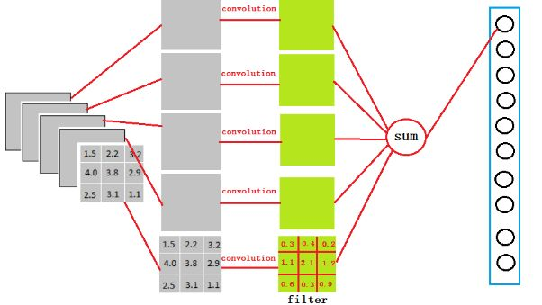

全连接层有1024个神经元，那我们就用1024个3x3x5 的过滤器进行卷积即可。

**第一个全连接层到第二个全连接层的过度也是通过卷积实现的**，若前层有1024个神经元，这层有512个，那可以看做前层有1024x1x1个feature map，然后用1x1的卷积核对这些feature map进行卷积，则得到100x1x1个feature map。

卷积神经网络要做的事情，大致分为两步：

1. 卷积层、采样层负责提取特征
2. 全连接层用于对提取到的特性进行分类

最后一步就和普通的神经网络没有什么区别，充当一个分类器的作用，输入是不同特征的特征值，输出是分类。

> 本部分参考文章：
>
> [对含有全连接层的网络输入数据大小固定问题的理解](https://blog.csdn.net/z13653662052/article/details/80252696)

------

在全连接层后，就可以根据实际情况用softmax对图片进行分类了：

到此，神经网络各个层次的讲解就结束了。