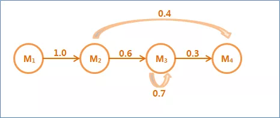
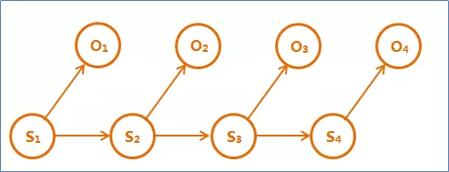
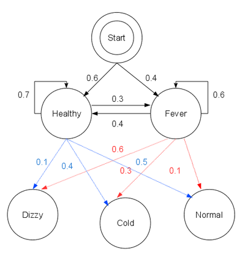
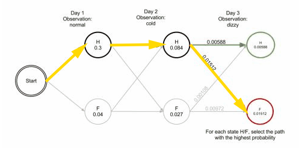

## 马尔可夫链

随机过程中各个状态St的概率分布，只与它的前一个状态St-1有关，这就是马尔可夫假设。符合马尔可夫假设的随机过程称为马尔可夫过程，也称为马尔可夫链，形象表示如下图：



圆圈代表一个状态，箭头的出方向表示当前状态可以转移到新的状态中去，箭头的入方向表示当前状态受到发出箭头的圆圈状态的影响。边上的权值是转移概率。

## 隐含马尔可夫模型（HMM）

隐含马尔可夫模型是上述马尔可夫链的一个扩展：任一时刻t的状态St是不可见的。所以观察者没法通过观察到一个状态序列S1,S2,S3,…,ST来推测转移概率等参数。但是隐含马尔可夫模型在每个时刻t会输出一个符号Ot，而且Ot和St相关且仅和St相关。

隐含马尔可夫模型的结构如下图，其中隐含的状态S1,S2,S3,S4是一个典型的马尔可夫链，这种模型称为“隐含”马尔可夫模型。




**隐含马尔可夫模型的五元组**：

HMM是一个五元组（O , Q , O0，A , B）:

1、O:{o1,o2,…,ot}是状态集合，也称为观测序列。

2、Q:{q1,q2,…,qv}是一组输出结果，也称为隐序列。

3、Aij = P(qj|qi)：转移概率分布

4、Bij = P(oj|qi)：发射概率分布

5、O0是初始状态，有些还有终止状态。

## 维特比(Viterbi)算法

**维特比算法**（**Viterbi algorithm**）是一种动态规划算法。它用于寻找最有可能产生观测事件的序列的**维特比路径**——隐含状态序列，特别是在马尔可夫信息源上下文和隐马尔可夫模型中。

维特比算法要做的大概就是通过已知的可以观察到的序列，和一些已知的状态转换之间的概率情况，通过综合状态之间的转移概率和前一个状态的情况计算出概率最大的状态转换路径，从而推断出隐含状态的序列的情况。

## HMM模型+维特比算法实例

### 1、问题描述

已知一个人连续三天的感觉为：{正常，冷，头晕}，那么这个人这三天的身体状况如何？

### 2、已知信息

我们称已知的状态序列 {正常，冷，头晕} 为**观测序列**。我们要求的是这三天的身体状况序列，我们称之为**状态序列**，例如{健康，发烧，健康}。

隐藏的状态：Healthy, Fever;

观测状态序列：{Normal, Cold, Dizzy};

初始状态：

> Healthy: 0.6;      
>
> Fever: 0.4;

状态转移概率：

> 健康->健康： 0.7
> 健康->发烧： 0.3
> 发烧->健康：0.4 
> 发烧->发烧： 0.6

状态 到 观测状态的发散概率：

> Healthy -> normal: 0.5, 
>
> Healthy -> cold: 0.4, 
>
> Healthy -> dizzy: 0.1,
>
> Fever ->  normal: 0.1,
>
> Fever ->  cold: 0.3, 
>
> Fever -> dizzy: 0.6

如下图所示：



### 3、求解

**第1天感到 Normal**

我们用 δ1(state) 表示第1天身体状态为state的时候，感觉到 Normal 的概率：

- δ1( H ) = p( H ) * p( N | H ) = 0.5 * 0.6 = **0.3**
- δ1( F )  = p( F ) * p( N | F ) = 0.1 * 0.4 = **0.04**  

也就是说到第1天为止，健康的概率0.3 大于发烧的概率0.04，可以认为第1天健康。

**第2天感到 Cold**

身体状态在前一天和后一天之间可能发生转移：

> p( H -> H ) = 0.7
> p( H -> F ) = 0.3
> p( F -> H ) = 0.4 
> p( F -> F ) = 0.6

我们用 δ2(state) 表示第2天身体状态为state的时候，感觉到 Cold 的概率：

- δ2( H ) = Max[ δ1( H ) * p( H -> H ),  δ1( F ) * p( F -> H )  ] * 0.4 = Max[0.21, 0.016] * 0.4 = **0.084**
- δ2( F )  = Max[ δ1( H ) * p( H -> F ),  δ1( F ) * p( F -> F )  ] * 0.3 = Max[0.09, 0.024] * 0.3 = **0.027**

也就是说到第2天为止，健康的概率0.084 大于发烧的概率0.027，可以认为第2天健康。

**第3天感到 Dizzy**

我们用 δ3(state) 表示第3天身体状态为state的时候，感觉到 Dizzy 的概率：

- δ3( H ) = Max[ δ2( H ) * p( H -> H ),  δ2( F ) * p( F -> H )  ] * 0.4 = **0.00588**
- δ3( F )  = Max[ δ2( H ) * p( H -> F ),  δ2( F ) * p( F -> F )  ] * 0.3 = Max[0.09, 0.024] * 0.3 = **0.01512**

也就是说到第3天为止，健康的概率0.00588 小于发烧的概率0.01512，可以认为第3天发烧。

整个过程如下：

![Animation of the trellis diagram for the Viterbi algorithm. After Day 3, the most likely path is ['Healthy', 'Healthy', 'Fever']](assets/Viterbi_animated_demo.gif)

从开始状态之后每走一步，就记录下**到达该状态的所有路径的概率最大值**，然后以此最大值为基准继续向后推进。显然，如果这个最大值都不能使该状态成为最大似然状态路径上的结点的话，那些小于它的概率值（以及对应的路径）就更没有可能了。将保存下的节点连成路径，如下图所示，这便是求得的隐含序列。




## 代码实现

```python
# 状态的样本空间
states = ('Healthy', 'Fever')
# 观测的样本空间
observations = ('normal', 'cold', 'dizzy')
# 起始个状态概率
start_probability = {'Healthy': 0.6, 'Fever': 0.4}
# 状态转移概率
transition_probability = {
   'Healthy' : {'Healthy': 0.7, 'Fever': 0.3},
   'Fever' : {'Healthy': 0.4, 'Fever': 0.6},
   }
# 状态->观测的发散概率
emission_probability = {
   'Healthy' : {'normal': 0.5, 'cold': 0.4, 'dizzy': 0.1},
   'Fever' : {'normal': 0.1, 'cold': 0.3, 'dizzy': 0.6},
   }


def viterbi(obs, states, start_p, trans_p, emit_p):
    # V 中第 t 个元素保存到时间t时，状态为Healthy和Fever的概率
    V = [{}]
    # path 保存 V 中各个时间概率最大的 state 所构成的路径
    # 保存前一时t-1刻所有节点中到t时刻某节点的最优值的路径
    path = {}

    # 初始化
    # 计算 δ1( H ) 和 δ1( F )
    # 得到 [{'Healthy': 0.3, 'Fever': 0.04000000000000001}]
    # emit_p 为状态->观测的发散概率
    for y in states:
        V[0][y] = start_p[y] * emit_p[y][obs[0]]
        path[y] = [y]

    # Run Viterbi for t > 0
    for t in range(1,len(obs)):
        V.append({})
        newpath = {}

        for y in states:
            # y 表示当前状态（先是 Healthy, 后是 Fever）
            # prob: 前一天 (t - 1时) 所有状态转移为 y 时的最大的概率
            # state: 最大概率时，对应的前一时刻t - 1的状态 y0
            (prob, state) = max([  (V[t-1][y0] * trans_p[y0][y] * emit_p[y][obs[t]], y0)   for y0 in states])
            # 在 V 的时刻 t 中保存转换为状态y的最大概率值
            V[t][y] = prob
            # 得到现在状态为 state 的概率比较大，于是保留t-1时刻 path 中状态为 state 所经过的节点
            newpath[y] = path[state] + [y]

        # 修改 path 为最新得到的newpath
        path = newpath

    # prob: 当前时刻 t 所有状态对应的概率最大的概率
    # state: prob对应的状态
    (prob, state) = max([(V[len(obs) - 1][y], y) for y in states])
    return (prob, path[state])

def example():
    return viterbi(observations,
                   states,
                   start_probability,
                   transition_probability,
                   emission_probability)
print(example())
# 输出(0.01512, ['Healthy', 'Healthy', 'Fever'])
# 表示隐含序列为：'Healthy', 'Healthy', 'Fever'
```

## 参考链接

> https://www.zhihu.com/question/20136144
>
> https://www.cnblogs.com/Denise-hzf/p/6612212.html
>
> https://zh.wikipedia.org/wiki/%E7%BB%B4%E7%89%B9%E6%AF%94%E7%AE%97%E6%B3%95

