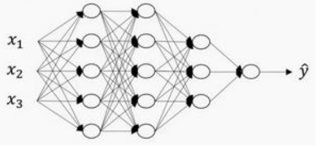
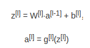
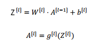
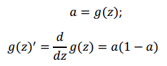
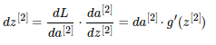
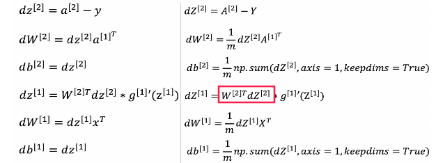
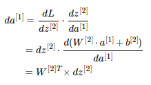
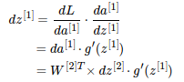
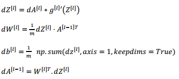

之前的文章中，我们已经讲解了只有一个隐藏层的神经网络模型，并且可以较好的完成平面点集的分类任务，但实际上，有很多复杂的函数，浅层的神经网络则无法拟合的很完美。

本文是对之前一系列文章的扩展，如果你觉得哪里不熟悉，可以翻看我之前发布的文章。

## 搭建神经网络块

深层的神经网络也许是这样的：



上图是一个四层的神经网络（输入层一般不记一层），我们用 L 表示神经网络的层数，n^[l] 表示第 l 层的神经元的数量。

由于神经网络具有许多层，在下图中用方框代表一层，每个层都要完成各自的任务，流程图大致如下所示：


绿框中的部分完成正向传播：

> 该过程的输入是 X 也就是 A^[0]，一层一层向后计算，最后得到A^[L]。
>
> 并且，在各层 l 计算出 A^[l] 的同时，**缓存**各层的输出值 A^[l] 到变量 cache 中，因为反向传播将会用上

红框中的部分完成反向传播：

> 该过程的输入是dA^[L]，并根据dA^[L]一步步向前计算，得到各层对应的dZ^[l]，dW^[l]，db^[l]
>
> 此外，还要计算出 dA^[l - 1] 作为前一层的输入

## 正向传播

先回顾一下浅层神经网络中，**单个样本**的正向传播的过程：


其中计算z^[1]时用到的 x 可以看做是 a^[0]，σ( ) 是激活函数中一种，一般情况下，我们更习惯用用 g( ) 来表示激活函数。于是将上述式子一般化可以得到第 l 层的公式为：



**向量化**后可以得到：



其中，A^[0] 就是m个训练样本组成的矩阵 X。由于我们需要计算多个隐藏层的数据，所以不可避免的需要使用 for 循环，将层数 l 从 1迭代到 L，一层一层的向后计算。

## 反向传播

之前，我们在计算一个隐藏层神经网络模型的时候，如果我们知道dA^[2]的值，就可以计算出dW^[2], db^[2], dW^[1], db^[1]，如果你忘记了，可以看看[这篇文章里的推导过程](https://www.zxxblog.cn/article/109)，相关公式如下：








如果你还记得 dZ^[1] 的推导过程：





你发现上图中红框内的部分，实际上就是dA^[1]。

所以，当我们知道dA^[L]之后，就可以逐层向前推导出 第 l 层的梯度，以及作为前一层输入的dA^[l - 1]：



求 dA^[L] 的python代码为：

```python
dAL = - np.divide(Y, AL) + np.divide(1 - Y, 1 - AL)
```

## 核对矩阵的维数

为了在写代码的过程中减少出现bug，尤其是在进行反向传播的时候，我们要注意核对矩阵的维数，这个知识点我们前面将[反向传播](https://www.zxxblog.cn/article/109)的文章中也提到了，大致规律如下：

> W^[l] ： (n^[l], n^[l - 1])
>
> Z^[l] ： (n^[l], m), 
>
> A^[l] ： (n^[l], m)

另外，还有一个规律：

> 对任意层而言：
>
> dW 的维度和 W 的维度相同 
>
> dZ 的维度和 Z 的维度相同 
>
> dA 的维度和 A 的维度相同


下一篇文章，我们会继续讲讲如何用 Python 编写更深层次的神经网络。


首先再看看深度学习的符号定义：，第一层神经元个数为5个，我们用 n^[1] = 5表示，同理可得：n^[2] = 5，n^[3] = 3，n^[4] = n^[L] = 1。我们将输入层记为 n^[0] = 3。

另外，我们用


