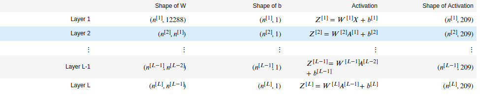
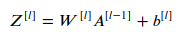
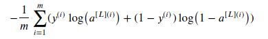
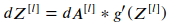
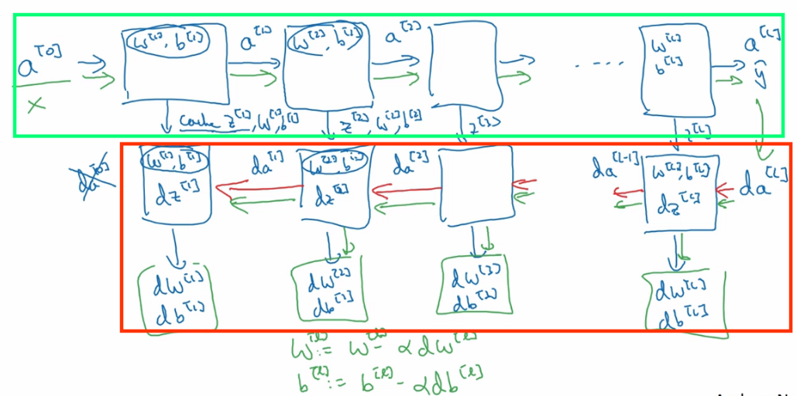
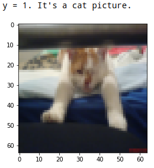
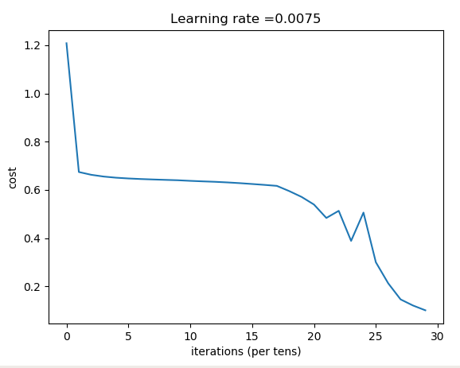

之前我们已经知道如何[用Python编写神经网络实现平面数据的分类](https://www.zxxblog.cn/article/110)，并且有了上一篇文章[深层神经网络模型的正向传播和反向传播推导](https://www.zxxblog.cn/article/111)的基础，我们可以尝试编写更复杂的神经网络，并用于处理简单的图像分类任务：判断一张图片中是否含有猫。本篇文章同样是吴恩达老师深度学习课程一个作业的精简版本。

## 引入所需要的库

本文使用的是 Anaconda 提供的 python3.7 以及以下库的支持：

- [numpy](https://www.zxxblog.cn/article/www.numpy.org) 不多说了，科学计算必备的库

- [matplotlib](http://matplotlib.org/) 利用python进行绘图的库

- [h5py](http://www.h5py.org/) 用来访问存储在H5内的数据

  如果你没有安装过上面说的的库，那我也建议你安装下Anaconda，会省事很多：[下载地址](https://www.anaconda.com/download/#windows)


```python
import numpy as np
import h5py
import matplotlib.pyplot as plt

```

## 编写一些工具函数

- load_data( ) 用于从.h5文件中读取并返回：训练集合(train_set_x_orig, train_set_y_orig)和预测集合(test_set_x_orig, test_set_y_orig)的数据以及图片类别(classes)，有209个测试集，50个训练集，更多关于数据集的信息，后面会详细说到。
- sigmoid( Z )，relu(Z)，激活函数，返回 A 和 Z
- sigmoid_backward(dA, cache)， relu_backward(dA, cache)：输入dA以及存放在参数cache中的Z，返回dZ

```python
def load_data():
    train_dataset = h5py.File('datasets/train_catvnoncat.h5', "r")
    train_set_x_orig = np.array(train_dataset["train_set_x"][:]) 
    train_set_y_orig = np.array(train_dataset["train_set_y"][:]) 

    test_dataset = h5py.File('datasets/test_catvnoncat.h5', "r")
    test_set_x_orig = np.array(test_dataset["test_set_x"][:]) 
    test_set_y_orig = np.array(test_dataset["test_set_y"][:])

    classes = np.array(test_dataset["list_classes"][:])
    
    train_set_y_orig = train_set_y_orig.reshape((1, train_set_y_orig.shape[0]))
    test_set_y_orig = test_set_y_orig.reshape((1, test_set_y_orig.shape[0]))
    
    return train_set_x_orig, train_set_y_orig, test_set_x_orig, test_set_y_orig, classes

def sigmoid(Z):
    A = 1/(1+np.exp(-Z))
    cache = Z
    return A, cache

def relu(Z):
    A = np.maximum(0,Z)
    assert(A.shape == Z.shape)
    cache = Z 
    return A, cache

def relu_backward(dA, cache):    
    Z = cache
    dZ = np.array(dA, copy=True) 
    # 当Z的元素 z <= 0, 将dZ对应的元素 dz 设置成 0 
    dZ[Z <= 0] = 0
    assert (dZ.shape == Z.shape)
    return dZ

def sigmoid_backward(dA, cache):    
    Z = cache
    a = 1/(1+np.exp(-Z))
    dZ = dA * a * (1-a)
    assert (dZ.shape == Z.shape)
    return dZ

```


## 搭建L层神经网络的流程

我们的神经网络前 L-1 层使用ReLu作为激活函数，最后一层使用sigmoid函数完成分类任务：

> [LINEAR->RELU] 执行 (L-1)次      ->    LINEAR->SIGMOID

流程图如下所示：


步骤如下：

- 随机初始化参数
- 分以下步骤实现正向传播（图片中紫色的部分）
  - 编写函数 linear_forward 完成一个神经元**线性部分**的计算，也就是计算出Z^[ l ]
  - 编写函数 linear_activation_forward 计算神经元的输出A^[ l ]
  - 将前两步的工作合并，构成 L_model_forward 函数，完成(L-1)次LINEAR->RELU 再完成一次 LINEAR->SIGMOID的任务
- 计算成本函数
- 分以下步骤实现反向传播 (图片中紫深红色的部分)
  - 编写函数 linear_backward 完成单个神经元反向传播中**线性部分**的工作：将 dZ , A_prev, W作为输入的一部分，返回dW, db等数据
  - 编写函数 linear_activation_backward 将 dA，Z等参数作为输入，返回dA_prev，dW，db。
  - 将前两步的工作合并，构成 L_model_backward 函数，先计算一次[LINEAR->SIGMOID]过程的反向传播，再计算 L - 1 次 [LINEAR->RELU] 过程的反向传播
- 最后更新相关的参数

我们会在正向传播的时候，缓存各层的数据到caches数组中，因为这些数据在对相应层进行反向传播的时候需要用到，具体看后面的代码实现。

## 1. 随机初始化参数

假设X是个(1228, 209)的矩阵，且各个参数的维度如下图所示，如果你还不熟悉下表的内容，可以回顾[深层神经网络模型的正向传播和反向传播推导](https://www.zxxblog.cn/article/111)的相关部分。



现在开始为 L 层的神经网络初始化参数。我们将网络各个层的神经元个数存放在数组 layer_dims 中，例如我们之前实现的浅层神经网络的 layer_dims = [2, 4, 1]，而 L 层网络的初始化方法如下代码所示，最终返回一个字典，包含"W1", "b1", ..., "WL", "bL"等数据。


```python
def initialize_parameters_deep(layer_dims):
    parameters = {}
    L = len(layer_dims)
    for l in range(1, L):
        parameters['W' + str(l)] = np.random.randn(layer_dims[l], layer_dims[l-1]) * np.sqrt(2 / layer_dims[l-1]) 
        parameters['b' + str(l)] = np.zeros((layer_dims[l], 1))
    return parameters
```

注意:  由于我们使用的激活函数是 Relu, 所以我们利用 "He初始化" 将随机初始化的 W 乘上 np.sqrt(2 / layer_dims[l-1]) , 目的是使得最终 Z 的值不至于过大, 导致落在激活函数斜率较小的部分,  如果斜率太小,  梯度下降的速度就慢了.  

更多关于如何优化神经网络表现的方法, 我会陆续发布相关的文章

## 2. 正向传播

要实现这个模块,  我们需要以下步骤

- 编写函数 linear_forward 完成一个神经元**线性部分**的计算，也就是计算出Z^[ l ]
- 编写函数 linear_activation_forward 计算神经元的输出A^[ l ]
- 将前两步的工作合并，构成 L_model_forward 函数，完成(L-1)次LINEAR->RELU 再完成一次 LINEAR->SIGMOID的任务

### 2.1 - 正向传播的线性部分

神经元**线性部分**完成以下计算其中, A^[0] = X:



我们用 linear_forward 函数实现:


```python
def linear_forward(A_prev, W, b):  
    Z = W.dot(A_prev) + b

    # cache 存放当前层线性部分的参数 "A_prev", "W" 和 "b"
    cache = (A_prev, W, b)
    return Z, cache
```

### 2.2 - 正向传播的激活函数部分

编写 linear_activation_forward 调用 linear_forward 将返回的 Z^[ l ] 作为激活函数输入, 使用当前层的激活函数计算神经元的输出A^[ l ].  还记得我们一开始写的工具函数吗? 在这里就用上了:


```python
def linear_activation_forward(A_prev, W, b, activation):
    # A_prev 是前一层神经元的输出.
    # activation 是使用的激活函数
    
    if activation == "sigmoid":
        Z, linear_cache = linear_forward(A_prev, W, b)
        A, activation_cache = sigmoid(Z)
    
    elif activation == "relu":
        Z, linear_cache = linear_forward(A_prev, W, b)
        A, activation_cache = relu(Z)
    
    # linear_cache指的是l层对应的输入A[l -1], 以及W[l], b[l]；
    # activation_cache 指的是 Z；
    cache = (linear_cache, activation_cache)

    return A, cache
```

上面的函数只能完成某层神经元的计算, 如果要计算总共 L 层的输出,我们还需要函数 L_model_forward 

### 2.3 -  L层模型的正向传播

将前两步2.1, 2.2的工作合并，构成 L_model_forward 函数，完成(L-1)次LINEAR->RELU 再完成一次 LINEAR->SIGMOID的任务, 并将各层的缓存 "cache" 添加到列表 "caches" 中, 将来会用于辅助反向传播的计算.


```python
def L_model_forward(X, parameters):
    caches = []
    A = X
    # 获取神经网络层数, // 表示整除
    L = len(parameters) // 2                  
    
    # 实现 [LINEAR -> RELU]*(L-1). 
    # 将前 L-1 层的缓存 "cache" 添加到列表 "caches" 中.
    for l in range(1, L):
        A_prev = A 
        A, cache = linear_activation_forward(A_prev, parameters['W' + str(l)], parameters['b' + str(l)], activation = "relu")
        caches.append(cache)
    
    # 实现 LINEAR -> SIGMOID
    # 将第 L 层的缓存 "cache" 添加到列表 "caches" 中.
    AL, cache = linear_activation_forward(A, parameters['W' + str(L)], parameters['b' + str(L)], activation = "sigmoid")
    caches.append(cache)
    
    return AL, caches
```

到这里,正向传播的任务就全部完成了.

## 3. 计算成本函数

成本函数公式如下:



参考上面的公式,我们可以实现所有样本的成本函数计算:

```python
def compute_cost(AL, Y):    
    m = Y.shape[1]
    
    # 分析矩阵的维数, 可以得知 Y 与 AL 是相同位置元素相乘的关系
    cost = - 1/m * np.sum( np.multiply(Y, np.log(AL)) + np.multiply(1 - Y, np.log( 1 - AL )) )

    # 或者可以这么算 cost:
    # cost = (1./m) * (-np.dot(Y,np.log(AL).T) - np.dot(1-Y, np.log(1-AL).T))
    # 还要确保计算出来的 cost 是一个数, 而不是矩阵
    # cost = np.squeeze(cost)    
    
    return cost
```


## 4. 反向传播

分步骤完成反向传播:

- 编写函数 linear_backward 完成单个神经元反向传播中**线性部分**的工作：将 dZ , A_prev, W作为输入的一部分，返回dW, db等数据
- 编写函数 linear_activation_backward 将 dA，Z等参数作为输入，返回dA_prev，dW，db。
- 将前两步的工作合并，构成 L_model_backward 函数，先计算一次[LINEAR->SIGMOID]过程的反向传播，再计算 L - 1 次 [LINEAR->RELU] 过程的反向传播

### 4.1 反向传播的线性函数部分

假设我们以及得到了当前层 dZ 的值,  编写函数  linear_backward 将 dZ 以及存放在cache中的A_prev, W作为输入, 计算出 dA_prev, dW, db 并返回.  

 cache 中的数据是我们在正向传播的过程中保留的, 从下面的代码中可以看到, 我们确实需要这些数据来计算梯度值dA_prev, dW, db


```python
def linear_backward(dZ, cache):
    # 取出当前层的正向传播时缓存的数据
    A_prev, W, b = cache
    m = A_prev.shape[1]
    
    dW = 1/m * np.dot(dZ, A_prev.T)
    db = 1/m * np.sum(dZ, axis = 1, keepdims = True)
    dA_prev = np.dot(W.T, dZ)
    
    return dA_prev, dW, db
```


### 4.2  反向传播激活函数部分

接下来, 编写函数 linear_activation_backward 来计算出 dZ :



并使用上面写好的linear_backward函数来计算dA_prev, dW, db.  其中激活函数的导数 g'() 对应函数 linear_backward 和 linear_backward在最开始的工具函数中已经实现了.


```python
# activation 用于指定当前层使用的激活函数
def linear_activation_backward(dA, cache, activation):
    # linear_cache指的是l层对应的输入A[l -1], 以及W[l], b[l]
    # activation_cache 指的是 Z；
    linear_cache, activation_cache = cache
    
    if activation == "relu":
        dZ = relu_backward(dA, activation_cache)
        dA_prev, dW, db = linear_backward(dZ, linear_cache)
        
    elif activation == "sigmoid":
        dZ = sigmoid_backward(dA, activation_cache)
        dA_prev, dW, db = linear_backward(dZ, linear_cache)
    
    return dA_prev, dW, db
```

### 4.3  L层模型的反向传播

整合4.1 和 4.2 的代码, 构成 L_model_backward 函数, 完成一次 "LINEAR->SIGMOID" 的反向层传播, 再完成 L-1 次 "LINEAR->SIGMOID" 的反向传播.

反向传播的时候, 需要将dAL作为反向传播的输入, 计算出dA^[L-1], dW^[L], db^[L].  进而 根据 dA^[L-1] 计算出dA^[L-2], dW^[L-1], db^[L-1].....以此类推可以得到dA^[0], dW^[1], db^[1]. 因为监督学习不需要调整输入的X, 所有dA^[0]没有用, 流程如下图红色部分所示:



根据损失函数的导数


可得到 dAL, 用python 表达为:

```python
dAL = - (np.divide(Y, AL) - np.divide(1 - Y, 1 - AL)) 
```

L_model_backward 函数如下: 


```python
# 形参 caches 由 L 个 cache 组成, 下标为 0 到 L-1 分别对应 1 到 L 层
# 每个 cache 为 (linear_cache, activation_cache)
# linear_cache指的是l层对应的输入A[l -1], 以及W[l], b[l]；
# activation_cache 指的是 Z；
def L_model_backward(AL, Y, caches):
    grads = {}
    L = len(caches) # the number of layers
    m = AL.shape[1]
    Y = Y.reshape(AL.shape) # after this line, Y is the same shape as AL

    # 第 L 层的反向传播
    dAL = - np.divide(Y, AL) + np.divide(1 - Y, 1 - AL)
    current_cache = caches[L - 1]
    grads["dA" + str(L - 1)], grads["dW" + str(L)], grads["db" + str(L)] = linear_activation_backward(dAL, current_cache, "sigmoid")

    
    # l 从第 L-1 层遍历至第 1 层, 完成第 l 层的反向传播:
    for l in reversed(range(1, L)): 
        # 注意 caches 的下标是从0到L-1, 第 l 层的缓存为 caches[l - 1]
        current_cache = caches[l-1]
        dA_prev_temp, dW_temp, db_temp = linear_activation_backward(grads['dA' + str(l)], current_cache, "relu")
        grads["dA" + str(l - 1)] = dA_prev_temp
        grads["dW" + str(l)] = dW_temp
        grads["db" + str(l)] = db_temp
       
    return grads
```

## 5. 更新参数

```python
def update_parameters(parameters, grads, learning_rate):
    
    L = len(parameters) // 2 
    for l in range(L):
        parameters["W" + str(l+1)] = parameters["W" + str(l+1)] - learning_rate * grads["dW" + str(l+1)]
        parameters["b" + str(l+1)] = parameters["b" + str(l+1)] - learning_rate * grads["db" + str(l+1)]
        
    return parameters
```


## 6. 完整的神经网络模型

```python
def L_layer_model(X, Y, layers_dims, learning_rate = 0.0075, num_iterations = 3000, print_cost=False):#lr was 0.009
    costs = []
    
    # 初始化参数
    parameters = initialize_parameters_deep(layers_dims)
    
    for i in range(0, num_iterations):

        # 正向传播
        AL, caches = L_model_forward(X, parameters)
        
        # 计算成本函数值
        cost = compute_cost(AL, Y)
    
        # 反向传播
        grads = L_model_backward(AL, Y, caches)
 
        # 更新参数
        parameters = update_parameters(parameters, grads, learning_rate)
                
        # 每迭代100次打印损一次成本函数的值
        if print_cost and i % 100 == 0:
            print ("Cost after iteration %i: %f" %(i, cost))
        if print_cost and i % 100 == 0:
            costs.append(cost)
            
    # 将成本函数值的变化用图表示出来
    plt.plot(np.squeeze(costs))
    plt.ylabel('cost')
    plt.xlabel('iterations (per tens)')
    plt.title("Learning rate =" + str(learning_rate))
    plt.show()
    
    return parameters
```

## 7. 预测函数

编程实现 predict 函数, 对输入的样本加以预测

```python
def predict(X, y, parameters):
    m = X.shape[1]
    
    probas, caches = L_model_forward(X, parameters)

    p = (probas > 0.5)

    print("Accuracy: "  + str(np.sum((p == y)/m)))
        
    return p
```

## 8. 应用我们的模型

### 8.1 简单了解我们用的数据集合

数据集合里面是两类图片, 一类包含猫, 一类不包含. 其中训练集图片数量为 209个, 测试集合有50个, 每张图片都是用 (64, 64, 3) 的矩阵表示. 通常, 我们会将图片转换成列矩阵: 


所有数据存储在.h5文件中, 借助 h5py 通过load_data()函数访问

如果你想查看图片, 引入文章开头提到的库后, 可以用以下代码查看图片:

```python
train_x_orig, train_y, test_x_orig, test_y, classes = load_data()
index = 29
plt.imshow(train_x_orig[index])
print ("y = " + str(train_y[0,index]) + ". It's a " + classes[train_y[0,index]].decode("utf-8") +  " picture.")
```

输出如下:



### 8.2 利用数据集合完成训练与预测

```python
# 载入数据
train_x_orig, train_y, test_x_orig, test_y, classes = load_data()

# Reshape 操作, 让数据集合变成 (12288, m) 
train_x_flatten = train_x_orig.reshape(train_x_orig.shape[0], -1).T  
test_x_flatten = test_x_orig.reshape(test_x_orig.shape[0], -1).T

# 标准化输入数据, 使之均介于 0 到 1 之间
train_x = train_x_flatten/255.
test_x = test_x_flatten/255.

# 5 层的模型
layers_dims = [12288, 20, 7, 5, 1] 

np.random.seed(1)
parameters = L_layer_model(train_x, train_y, layers_dims, num_iterations = 3000, print_cost = True)

# 对训练集的预测
pred_train = predict(train_x, train_y, parameters)

# 对测试集的预测
pred_test = predict(test_x, test_y, parameters)
```

输出如下:

> Cost after iteration 0: 1.208125
>
> Cost after iteration 100: 0.674058
>
> Cost after iteration 200: 0.662505
>
> Cost after iteration 300: 0.655233
>
> Cost after iteration 400: 0.650489
>
> Cost after iteration 500: 0.647319
>
> Cost after iteration 600: 0.644942
>
> Cost after iteration 700: 0.643098
>
> Cost after iteration 800: 0.641445
>
> Cost after iteration 900: 0.639893
>
> Cost after iteration 1000: 0.637406
>
> Cost after iteration 1100: 0.635323
>
> Cost after iteration 1200: 0.633421
>
> Cost after iteration 1300: 0.630908
>
> Cost after iteration 1400: 0.627870
>
> Cost after iteration 1500: 0.624349
>
> Cost after iteration 1600: 0.620656
>
> Cost after iteration 1700: 0.616561
>
> Cost after iteration 1800: 0.594951
>
> Cost after iteration 1900: 0.570737
>
> Cost after iteration 2000: 0.539141
>
> Cost after iteration 2100: 0.483494
>
> Cost after iteration 2200: 0.513117
>
> Cost after iteration 2300: 0.388391
>
> Cost after iteration 2400: 0.505814
>
> Cost after iteration 2500: 0.299827
>
> Cost after iteration 2600: 0.212398
>
> Cost after iteration 2700: 0.145691
>
> Cost after iteration 2800: 0.120416
>
> Cost after iteration 2900: 0.100510
>
> 
>
> Accuracy: 0.9999999999999998
>
> Accuracy: 0.8

这个训练结果似乎表现为过拟合了.

接下来, 我打算学习下如何优化神经网络模型.


本文的python代码和训练集合: [https://github.com/zxxwin/DLnote/tree/master/python%20code/Deep%20Neural%20Network](https://github.com/zxxwin/DLnote/tree/master/python%20code/Deep%20Neural%20Network)

英文版 notebook 编写的原文地址: [https://github.com/zxxwin/DLnote/tree/master/jupyter%20notebook/Deep%20Neural%20Network](https://github.com/zxxwin/DLnote/tree/master/jupyter%20notebook/Deep%20Neural%20Network)