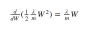
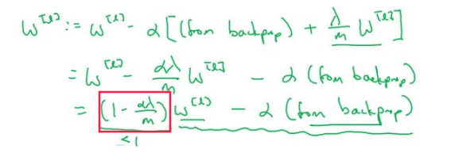
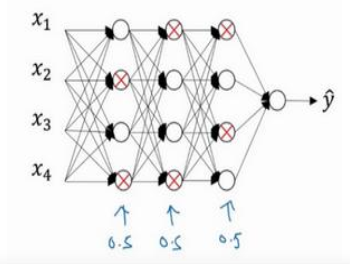
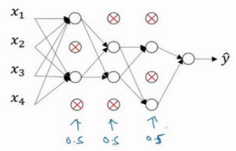

在训练神经网络的时候,  我们经常会遇到过拟合的问题, 也就是训练集表现特别好, 测试集表现就差的多.  除了可以通过增加数据来优化效果,  还可以通过正则化来解决问题.

## L2 正则化

应用 L2 正则化,  我们需要对成本函数进行修改, 其中 lamda 是正则化参数:


修改后的成本函数, 相比原来的成本函数多了 L2正则化项: 


虽然看着很复杂, 其实做的事情很简单:

- lamda/2 是引入正则化后带来的超参数, 其中分母取 2 完全是为了求导方便, 因为 lamda 是任意数,  所以 lamda 和 lamda/2 没有本质的区别
- 第2个和第3个累加符号是表示将第 l 层的矩阵 W^[l] 的所有元素进行平方操作, 然后求和
- 第一个累加符号表示对   所有层的矩阵 W 的所有元素 W_k_j 的平方 求和
- 最前面的 1/m 是取均值

说简单点, 就是所有层矩阵 **W 的所有元素的平方和 的平均值**.假如你的神经网络只有三层, 那么要做的就是:

```
L2_regularization_cost = lambd/(2 * m) * (np.sum(np.square(W1)) + np.sum(np.square(W2)) + np.sum(np.square(W3)))
```

对 L2 正则化项求导可以得到:



由于参数W的更新方法如下:


由于成本函数带L2正则化项, 因此, W的梯度下降公式变为:



上图红框部分是小于1的数, 每次更新权重W时 , 都会乘上一个小于 1 的系数, 因此𝐿2正则化也被称为"权重衰减".

## 为什么L2正则化有用

首先我们知道, 由于神经网络越复杂, 其表达能力就越强, 因而就更容易发生过拟合.

但是现在有了正则化项, 我们在降低成本函数值的同时, 需要保证 W 中元素的值都不会太大, 有了这个约束, 最终 W 会是一个比较小的值, 这样所有神经元的权重就会变小. 另外, 如果超参数 lamd 设置的足够大, 那么权重W最终可能会接近于0,  间接达到了化简神经网络的作用.

如果能取得合适的 lamd 的值, 那么这个神经网络就可以达到不是特别复杂并且刚刚好能表达数据的输入输出过程.

这样就可以减少过拟合的发生了.

## Dropout 正则化

另一个方法就是 Dropout, 也叫做随机失活. 假如你要训练的神经网络模型如下, 并且发生了过拟合:



为了降低神经网络的复杂程度, Dropout 会在每一层(输入层除外) 都以一定概率(本例中取0.5)随机让一些节点失活, 所谓的让神经元失活, 就是让该神经元的输出变为0, 一般做法是随机让某一层输出的矩阵A中的部分元素变为0, 这样这部分神经元在正向传播和反向传播中都没有贡献, 也就消除了神经元的作用, 可以理解为"删除"经过失活的节点的路径, 达到化简的目的:



每次训练都会让整个网络的神经元随机失活, 所以每次都能得到不同结构的神经网络模型,  每次训练都像在训练一个新的网络. 

比较常见的一种 Dropout 叫做  **Inverted dropout** (反向随机失活). 我们会设置一个 keep_prob 用来表示某一层神经元的保留概率, 例如 keep_prob = 0.8 表示这一层中有80%的神经元得到保留. 另外, 不同层可以设置不同的 keep_prob, 越复杂的层一般 keep_prob 就设置的越高, 当 keep_prob 设置为1时, 就相当于没有使用 Dropout. 

代码实现如下:

```python
Z2 = np.dot(W2, A1) + b2
A2 = relu(Z2)
# 随机生成和 A2 相同维度的矩阵
D2 = np.random.rand(A2.shape[0], A2.shape[1])    
# 保留部分元素: 小于keep_prob的设为 True, 否则设为 0 
D2 = D2 < keep_prob                             
# 对应位置的元素相乘, 可以把 True 看做 1, False 看做 0. 
A2 = np.multiply(A2, D2)                        
# 如果没有下面这行就是普通的 Dropout
A2 = A2/keep_prob    
```

怎么理解最后一行呢? 由于 Z3 = np.dot(W3, A2) + b3 ,  为了不太影响 Z3 最终的期望值, 我们用 A2 = A2/keep_prob 来修正或者补偿因为神经元消失而减少的输出. 

要注意的是, 我们不希望在测试的时候, 得到的结果也是随机的, 因此Dropout  **在测试过程不使用**.

## 为什么 Dropout 正则化有用

最直观的理解就是, 训练的时候, 神经网络模型都被简化了, 也就减少了过拟合的情况.

另一种解释是, dropout 让神经网络都不过分依赖于某个特征(过分依赖的表现是给的权重比较高), 因为每个特征都可能被清除掉, 结果就是神经网络不会给某个单元分配很高的权值, 而是为每个单元都增加一些权值, 进而降低了过分拟合某个噪点的情况发生,达到减少过拟合的效果.

参考链接:

[深度学习-过拟合(Andrew Ng. DL 笔记)](http://www.shuang0420.com/2017/08/29/%E7%A5%9E%E7%BB%8F%E7%BD%91%E7%BB%9C-%E8%BF%87%E6%8B%9F%E5%90%88(Andrew%20Ng.%20DL%20%E7%AC%94%E8%AE%B0))