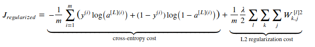
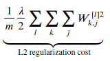

在训练神经网络的时候,  我们经常会遇到过拟合的问题, 也就是训练集表现特别好, 测试集表现就差的多.  除了可以通过增加数据来优化效果,  还可以通过正则化来解决问题.

## L2 正则化

应用 L2 正则化,  我们需要对成本函数进行修改, 其中 lamda 是正则化参数:



修改后的成本函数, 相比原来的成本函数多了这部分: 



虽然看着很复杂, 其实做的事情很简单:

- lamda/2 是引入正则化后带来的超参数, 其中分母取 2 完全是为了求导方便, 因为 lamda 是任意数,  所以 lamda 和 lamda/2 没有本质的区别
- 第2个和第3个累加符号是表示将第 l 层的矩阵 W^[l] 的所有元素进行平方操作, 然后求和
- 第一个累加符号表示对   所有层的矩阵 W 的所有元素 W_k_j 的平方 求和
- 最前面的 1/m 是取均值

说简单点, 就是所有层矩阵 W 的所有元素的平方和  的平均值.假如你的神经网络只有三层, 那么要做的就是:

```
L2_regularization_cost = lambd/(2 * m) * (np.sum(np.square(W1)) + np.sum(np.square(W2)) + np.sum(np.square(W3)))
```


[深度学习-过拟合(Andrew Ng. DL 笔记)](http://www.shuang0420.com/2017/08/29/%E7%A5%9E%E7%BB%8F%E7%BD%91%E7%BB%9C-%E8%BF%87%E6%8B%9F%E5%90%88(Andrew%20Ng.%20DL%20%E7%AC%94%E8%AE%B0))