这篇文章是对吴恩达老师在网易云课堂 神经网络和深度学习 的3.9 神经网络的梯度下降法 和 3.10  （选修）直观理解反向传播课程的理解和补充。

看这篇文章之前，最好要先熟悉我之前发布的一篇文章：[浅层神经网络的正向传播过程](https://www.zxxblog.cn/article/100) , 这样对于下面将出现的一些约定和说明会有更好的理解。

### 符号约定

首先看看下面这张图：

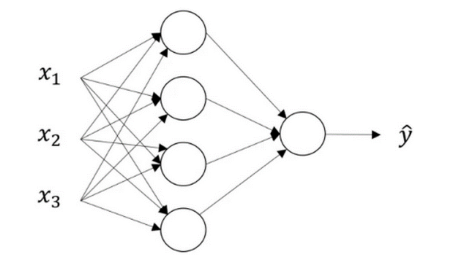

我们假设n[l] 表示第 l 层的神经元的数量，那么这个单隐层的神经网络的输入层、隐含层和输出层的维度分别是：n[0]= n_x =3、n[1]=4、n[2]=1。

那么根据[正向传播那篇文章](https://www.zxxblog.cn/article/100)的分析，如果一次性输入带有 m 个样本的矩阵 X 我们可以得到：

> W^[1] = (4, 3), Z^[1] = (4, m), A^[1] = (4, m)
>
> W^[2] = (1, 4), Z^[2] = (1, m), A^[2] = (1, m)

可以总结出如下规律，对第 l 层的单元而言：

> W^[l] = (n^[l], n^[l-1]), 
>
> Z^[l] = (n^[l], m), 
>
> A^[1] = (n^[l], m).

另外，还有一个规律：

> 对任意层而言：
>
> dW 的维度和 W 的维度相同
>
> dZ 的维度和 Z 的维度相同
>
> dA 的维度和 A 的维度相同

注意：以上出现的符号都是将m个样本向量化后的表达。

### 单个样本的梯度计算

讲反向传播前，我们先回顾一下单个样本的正向传播的过程：

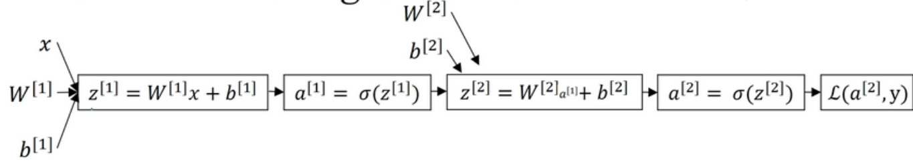

其中计算z^[1]时用到的 x 可以看做是 a^[0]，σ( ) 是激活函数中一种，一般情况下，我们更习惯用用 g( ) 来表示激活函数。于是将上述式子一般化可以得到第 l 层的公式为：

> z^[l] = W^[l]a^[l-1] + b^[l] --------- ① 
>
> a^[l] = g^[l] ( z^[l] ) ------------------- ②

由于我们输入的样本只有一个，所以各个向量的维度如下：

> W^[l] = (n^[l], n^[l-1]), 
>
> z^[l] = (n^[l], 1), 
>
> a^[1] = (n^[l], 1).

我们现在根据式子 ① 和 ② 来讨论反向传播的过程。

因为正向传播的时候我们依次计算了z^[1], a^[1], z^[2], a^[2]最终得到了损失函数L。所以反向传播的时候，我们要从L向前计算梯度。

第一步计算 da^[2] 和 dz^[2]进而算出 dW^[2] 和 db^[2]：

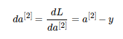

> 说明 ①：
>
> dz^[2] 的维度和z^[2]相同，da^[2]  的维度和a^[2]相同，为(1, 1)
>
> g'( z^[2] ) 的维度与 z^[2]维度相同，为(1, 1)
>
> 在第二层中，a^[2] 与 z^[2]的维度也相同，为(1, 1)
>
> 实际上，dz^[2] 应该等于da^[2] 与 g'( z^[2] ) 的内积的结果，理由我们我们先向下看。

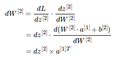

> 说明 ②：
>
> 上图中我们可以得到  dW^[2] = dz^[2]乘上 a^[1] 的转置，这里是因为 :
>
> dW^[2] 和 W^[2] 的形状是一样的(n^[2], n^[1])也就是(1, 4)，
>
> dz^[2]  和 z^[2] 的形状是一样的(n^[2], 1)也就是(1, 1)，
>
> a^[1] 的形状是 (n^[1], 1) 也就是(4, 1)，可以得到 a^[1] 的转置 a^( [1]T ) 的形状是 (1, 4)，
>
> 这样 dz^[2]  和 a^[1] 的转置 的乘积的形状才能是 dW^[2] 的形状 (1, 4)；
>
> 因此 dW^[2] = dz^[2]乘上 a^[1] 的转置。
>
> 这里给我们的启发是：**向前求导的时候注意矩阵的维度变化，通过分析矩阵的维度来判断矩阵是否需要进行转置操作**。

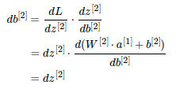

第二步计算 da^[1] 和 dz^[1]进而算出 dW^[1] 和 db^[1]

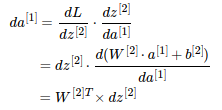

> 检查矩阵形状是否匹配：(4, 1) = (4, 1) x  (1, 1)，匹配

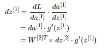

> 说明③：
>
> dz^[1] 的维度和z^[1]相同，da^[1]  的维度和a^[1]相同，均为(4, 1)
>
> W^[2]T 的维度是 (4, 1)，dz^[2] 的维度是 (1, 1) ，二者的乘积与da^[1] 维度相同。
>
> g'( z^[1] ) 的维度与 z^[1]维度相同，也与da^[1] 维度相同，为(4, 1)。
>
> 所以想得到维度为 (4, 1) 的dz^[1] ，da^[1] 与 g'( z^[1] )  直接的关系为**内积**
>
> 这里给我们的启发是：**向前求导的时候注意矩阵的维度变化，通过分析矩阵的维度来判断矩阵是否需要进行内积操作**。
>
> 这里就解释了说明①留下的问题。

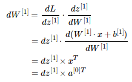

> 检查维度：(4, 3) = (4, 1) x (1, 3)，正确

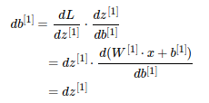

到这里，单个样本的所有的参数的梯度就差不多都算出来了，但是我们一般不会一个一个样本的去计算，借助向量化我们可以可以一次性计算出m个样本的梯度。

### 多个样本的梯度计算

用**m个样本**作为输入，并进行**向量化**后正向传播的公式：

> Z^[1] = W^[1]X + b^[1]     
>
> A^[1] = g^[1] (  Z^[1]  )  	
>
> Z^[2] = W^[2]A^[1] + b^[2]   	
>
> A^[2] = g^[2] (  Z^[2]  )   

由于引入了m个样本，所以我们也要有个成本函数来衡量整体的表现情况，我们的目的是要让 J 达到最小值。

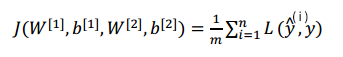

下图中左边列举了我们上面所推导的各种式子，其中图中所用的激活函数 g^[2] () 为sigmoid函数，因而dz^[2] = a^[2] - y。这些左边的式子都是针对单个样本而言的，而右边则是将m个样本作为输入并向量化后的公式的表达形式。

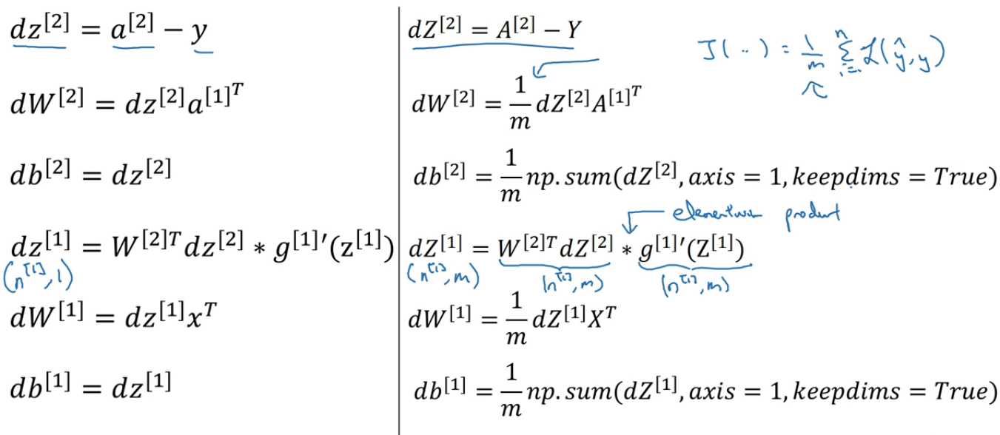

> 上图的说明：
>
> 1. 由于成本函数 J 是所有的 损失函数 L  的值求和后的**平均值**， **那么 J 对 W^[1], b^[1], W^[2], b^[2] 的导数 等价于 各个 L 对  W^[1], b^[1], W^[2], b^[2] 的导数求和后的平均值**。所以dW^[1], db^[1], dW^[2], db^[2]的式子中需要乘上 1 / m。具体可以参考  [神经网络基础之logistic回归 ](https://www.zxxblog.cn/article/99) 中标题 “ 向量化logistc回归的梯度输出 ”下的内容。
> 2. 计算db^[1]和db^[2]时的程序代码的sum函数的第二个参数 axis=1 表示水平相加求和。
> 3. keepdims=True是为了保持矩阵的shape属性值是我们熟悉的()中有两个数字的形式，例如(1, m)，(4, m)等，如果不加上可能得到的是奇怪的(1,   )，(4,    )这样的形式。

### 更新参数

最后别忘记要更新参数（式子中 α 是学习率）：

到此为止，神经网络的反向传播的知识就说的差不多了，希望对你有所帮助。

> 参考文章：
>
> [吴恩达深度学习细节补充（一）——正向传播与反向传播](https://blog.csdn.net/livan1234/article/details/81559649)
>
> [吴恩达深度学习 反向传播（Back Propagation）公式推导技巧](https://www.cnblogs.com/southtonorth/p/9512559.html)

