### 常见激活函数

使用一个神经网络的时候，需要利用激活函数将 z^[i] 作为参数，生成 a^[i] ：

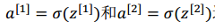

我们之前常用的激活函数是 sigmoid函数，但是激活函数不只有 sigmoid 一个，其他的激活函数效果可能更好。

通常，a^[i] = g( z^[i] )，式子中的 g 可以是除了 sigmoid 外的非线性函数，例如 tanh 和 Relu。

####  **tanh 函数**

 **tanh 函数**函数图像及公式如下：

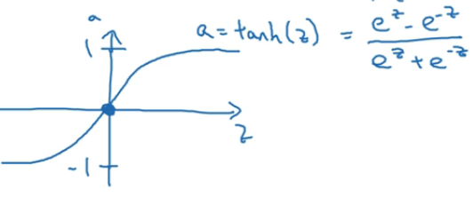

它实际上是 sigmoid 函数平移拉升后的结果，其取值范围是 (-1, 1)，因而其平均值更接近于 0 ，这样可以让下一层的学习更简单一些，具体原因之后再讨论。

tanh 效果整体上优于 sigmoid 函数，因此通常情况下，我们尽量都使用tanh函数 替换 sigmoid 函数可以取得更好的效果，如下图

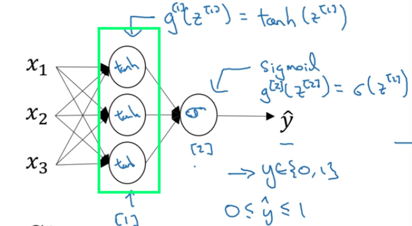

但是也有例外，比如当我们进行二分类的时候，其结果是 0 和 1 之间的一个数，因此 y帽 的值必须介于 0 和 1 ，因此本模型的输出层应该用 sigmoid函数，如下图所示：

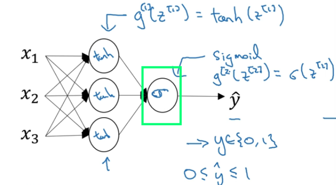

同样为了区分不同层的激活函数，我们也使用 ^[i] 来区分第一层的 g^[1] 和第二层的 g^[2]. 不同层的激活函数都可能不同。

但是，sigmoid 函数和 tanh 函数都有共同的缺点： 在 z 趋于正无穷大，或者趋于负无穷小的时候，函数的导数或者导数的梯度会变的特别小，小到接近于0，导致梯度下降的速度减慢。因此我们再介绍一个机器学习里特别受欢迎的激活函数 Relu函数。

#### Relu函数

**Relu函数**其表达式为：a = max (0, z )，函数图像如下图所示

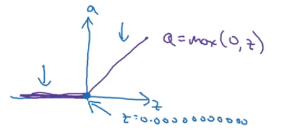

只要𝑧是正值的情况下，导数恒等于 1，当𝑧是负值的时候，导数恒等于 0。z 等于0的时候没有导数，但是我们不需要担心这个点，假设其导数是0或者1即可。

激活函数选择的经验：**如果输出是0和1的二分类问题，则输出层选择 sigmoid 函数，其他层选择 Relu 函数**。

还存在另一个版本的Relu 函数，称为 Leaky Relu，实际使用的比较少

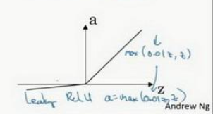

总结一下Relu 激活函数的优点：

Relu 函数在 z>0 的部分的导数值都大于0，并且不趋近于0，因而梯度下降速度较快。

Relu 函数在 z<0 的部分的导数值都等于0，此时神经元（就是模型中的圆圆）就不会得到训练，产出所谓的稀疏性，降低训练出来的模型过分拟合的概率。但即使这样，也有足够多的神经元使得 z>0。

### 如何选择激活函数

1. sigmoid 激活函数：除了输出层是一个二分类问题基本不会用它。
2. tanh 激活函数： tanh 是非常优秀的， 几乎适合所有场合。
3. ReLu 激活函数：最常用的默认函数，如果不确定用哪个激活函数，就使用 ReLu 或者Leaky ReLu。

### 为什么需要非线性激活函数

先看个例子，比如我们需要给下面的图像进行二分类，也就是找出圆圈和三角形的边界：

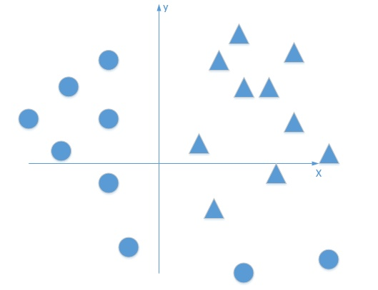

如果没有激活函数，我们训练出来的分类器是线性的，它的效果也许会是这样：

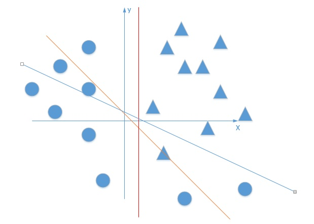

始终无法完美的完成任务。训练出来的模型只是把输入的数据线性组合后再输出，即使你有多个隐藏层，本质上也是在进行线性计算，其结果仍然是一个线性函数，无法完成复杂的分类任务。

然而，如果我们训练出来的模型是非线性的，那么它的分类效果可能是这样的：

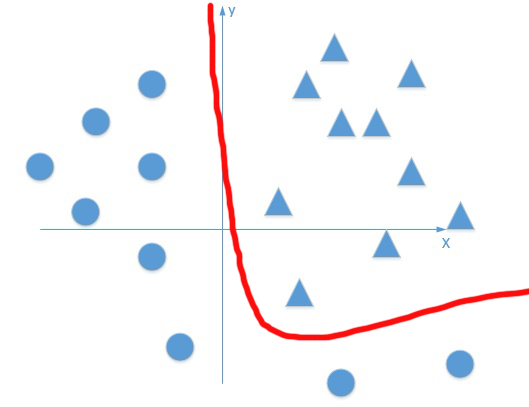

要实现这样的分类效果，就需要借助非线性的激活函数（比如 tanh函数 就是非线性的 ）将每一层的输出 z 进行一次非线性的变换得到 a

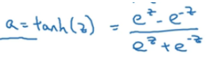

这样可以加入非线性因素，让原本的直线（或者平面）“扭曲”起来，达到拟合复杂的曲线(或者曲面)的效果，这样就提高神经网络对模型的表达能力，让神经网络的模型任意逼近复杂的函数。显然非线性拟合的效果要比线性拟合的效果好的多。

> 参考链接：[神经网络激励函数的作用是什么？有没有形象的解释？](https://www.zhihu.com/question/22334626)

### 激活函数的导数

在进行神经网络反向传播的时候，需要计算激活函数的斜率或者导数。

**sigmoid 的求导**：

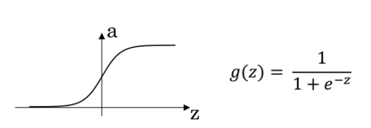

我们将 g(z) 对 z 求导后变形就可以得到：

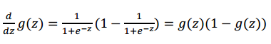

更一般的，我们会这么表示：

这个式子，我们之前讲逻辑回归的时候已经说过。

**tanh 的求导**

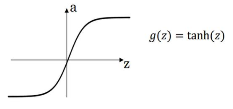

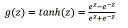

我们同样将 g(z) 对 z 求导后变形就可以得到：

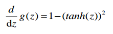

我们同样用 a 来表示 g(z)，于是可以得到：

**Relu 的求导**

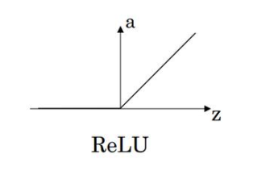

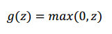

将 g(z) 对 z 求导后就可以得到：

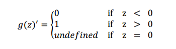

本篇文章到这就结束了，下一篇文章，我们会一起看看有关神经网络是如何进行梯度下降的。